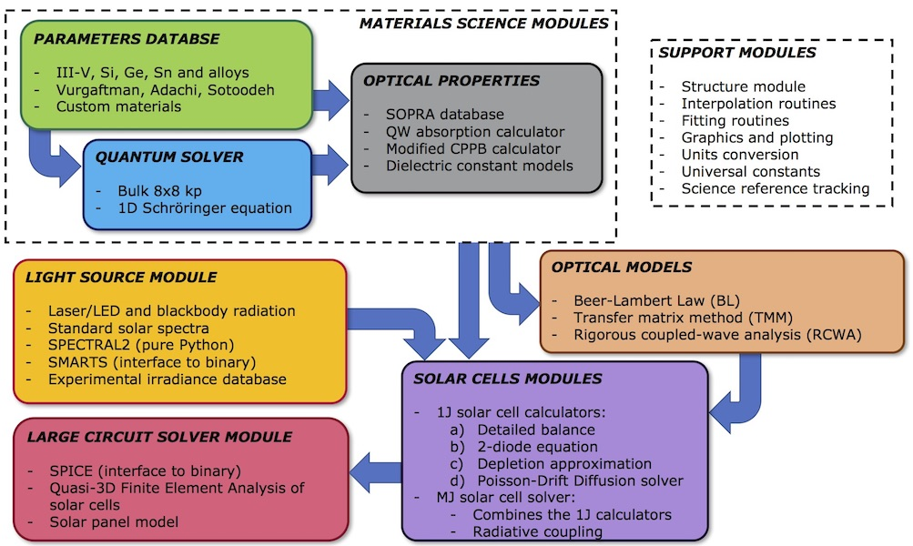

<!-- ALL-CONTRIBUTORS-BADGE:START - Do not remove or modify this section -->

<!-- ALL-CONTRIBUTORS-BADGE:END -->

Solcore
=======

**Solcore** was born as a modular set of tools, written (almost) entirely in Python 3, to address some of the task we had to solve more. With time, however, it has evolved as a complete semiconductor solver able of modelling the optical and electrical properties of a wide range of solar cells, from quantum well devices to multi-junction solar cells.

Please, visit [Solcore\'s Documentation](http://docs.solcore.solar), the [Tutorial](docs/source/Examples/tutorial.rst) for a step-by-step example of how to use *Solcore* to model a solar cell and also check the [Examples folder](examples) for more specific information and examples of usage.

## Contributors ✨

Thanks goes to these wonderful people ([emoji key](https://allcontributors.org/docs/en/emoji-key)):

<!-- ALL-CONTRIBUTORS-LIST:START - Do not remove or modify this section -->
<!-- prettier-ignore-start -->
<!-- markdownlint-disable -->
<table>
  <tbody>
    <tr>
      <td align="center" valign="top" width="14.28%"><a href="https://www.imperial.ac.uk/admin-services/ict/self-service/research-support/rcs/research-software-engineering/"> <b>Diego Alonso Álvarez</b></a> <a href="https://github.com/qpv-research-group/solcore5/commits?author=dalonsoa" title="Code">💻</a> <a href="https://github.com/qpv-research-group/solcore5/issues?q=author%3Adalonsoa" title="Bug reports">🐛</a> <a href="https://github.com/qpv-research-group/solcore5/commits?author=dalonsoa" title="Documentation">📖</a> <a href="#example-dalonsoa" title="Examples">💡</a> <a href="#ideas-dalonsoa" title="Ideas, Planning, & Feedback">🤔</a> <a href="#infra-dalonsoa" title="Infrastructure (Hosting, Build-Tools, etc)">🚇</a> <a href="#maintenance-dalonsoa" title="Maintenance">🚧</a> <a href="https://github.com/qpv-research-group/solcore5/pulls?q=is%3Apr+reviewed-by%3Adalonsoa" title="Reviewed Pull Requests">👀</a> <a href="https://github.com/qpv-research-group/solcore5/commits?author=dalonsoa" title="Tests">⚠️</a> <a href="#data-dalonsoa" title="Data">🔣</a></td>
      <td align="center" valign="top" width="14.28%"><a href="https://www.qpvgroup.org/phoebe-pearce"> <b>Phoebe Pearce</b></a> <a href="https://github.com/qpv-research-group/solcore5/commits?author=phoebe-p" title="Code">💻</a> <a href="https://github.com/qpv-research-group/solcore5/issues?q=author%3Aphoebe-p" title="Bug reports">🐛</a> <a href="https://github.com/qpv-research-group/solcore5/commits?author=phoebe-p" title="Documentation">📖</a> <a href="#example-phoebe-p" title="Examples">💡</a> <a href="#ideas-phoebe-p" title="Ideas, Planning, & Feedback">🤔</a> <a href="#maintenance-phoebe-p" title="Maintenance">🚧</a> <a href="https://github.com/qpv-research-group/solcore5/pulls?q=is%3Apr+reviewed-by%3Aphoebe-p" title="Reviewed Pull Requests">👀</a> <a href="https://github.com/qpv-research-group/solcore5/commits?author=phoebe-p" title="Tests">⚠️</a> <a href="#data-phoebe-p" title="Data">🔣</a></td>
      <td align="center" valign="top" width="14.28%"><a href="https://github.com/twmwilson"> <b>Tom Wilson</b></a> <a href="https://github.com/qpv-research-group/solcore5/commits?author=twmwilson" title="Code">💻</a> <a href="https://github.com/qpv-research-group/solcore5/issues?q=author%3Atwmwilson" title="Bug reports">🐛</a> <a href="https://github.com/qpv-research-group/solcore5/commits?author=twmwilson" title="Documentation">📖</a> <a href="#example-twmwilson" title="Examples">💡</a> <a href="#ideas-twmwilson" title="Ideas, Planning, & Feedback">🤔</a> <a href="https://github.com/qpv-research-group/solcore5/pulls?q=is%3Apr+reviewed-by%3Atwmwilson" title="Reviewed Pull Requests">👀</a> <a href="https://github.com/qpv-research-group/solcore5/commits?author=twmwilson" title="Tests">⚠️</a> <a href="#data-twmwilson" title="Data">🔣</a></td>
      <td align="center" valign="top" width="14.28%"><a href="http://www.qpvgroup.org"> <b>Ned Ekins-Daukes</b></a> <a href="https://github.com/qpv-research-group/solcore5/commits?author=iclned" title="Documentation">📖</a> <a href="#example-iclned" title="Examples">💡</a> <a href="#ideas-iclned" title="Ideas, Planning, & Feedback">🤔</a> <a href="#financial-iclned" title="Financial">💵</a> <a href="https://github.com/qpv-research-group/solcore5/pulls?q=is%3Apr+reviewed-by%3Aiclned" title="Reviewed Pull Requests">👀</a> <a href="https://github.com/qpv-research-group/solcore5/commits?author=iclned" title="Tests">⚠️</a></td>
      <td align="center" valign="top" width="14.28%"><a href="https://github.com/MarkusFF"> <b>MarkusFF</b></a> <a href="https://github.com/qpv-research-group/solcore5/commits?author=MarkusFF" title="Code">💻</a> <a href="https://github.com/qpv-research-group/solcore5/issues?q=author%3AMarkusFF" title="Bug reports">🐛</a> <a href="https://github.com/qpv-research-group/solcore5/commits?author=MarkusFF" title="Documentation">📖</a> <a href="#example-MarkusFF" title="Examples">💡</a> <a href="#ideas-MarkusFF" title="Ideas, Planning, & Feedback">🤔</a> <a href="#design-MarkusFF" title="Design">🎨</a> <a href="#data-MarkusFF" title="Data">🔣</a></td>
      <td align="center" valign="top" width="14.28%"><a href="https://github.com/jcohen02"> <b>Jeremy Cohen</b></a> <a href="#infra-jcohen02" title="Infrastructure (Hosting, Build-Tools, etc)">🚇</a></td>
      <td align="center" valign="top" width="14.28%"><a href="https://github.com/PieceMaker"> <b>Jonathan Adams</b></a> <a href="https://github.com/qpv-research-group/solcore5/commits?author=PieceMaker" title="Tests">⚠️</a> <a href="https://github.com/qpv-research-group/solcore5/pulls?q=is%3Apr+reviewed-by%3APieceMaker" title="Reviewed Pull Requests">👀</a></td>
    </tr>
    <tr>
      <td align="center" valign="top" width="14.28%"><a href="https://github.com/mhrownaghi"> <b>Mohammad Hosein Ronaghi</b></a> <a href="https://github.com/qpv-research-group/solcore5/commits?author=mhrownaghi" title="Tests">⚠️</a> <a href="https://github.com/qpv-research-group/solcore5/commits?author=mhrownaghi" title="Code">💻</a></td>
      <td align="center" valign="top" width="14.28%"><a href="https://github.com/federikovi"> <b>Federica Trevisan</b></a> <a href="#example-federikovi" title="Examples">💡</a></td>
      <td align="center" valign="top" width="14.28%"><a href="https://github.com/Artyko"> <b>Artyko</b></a> <a href="https://github.com/qpv-research-group/solcore5/commits?author=Artyko" title="Code">💻</a></td>
      <td align="center" valign="top" width="14.28%"><a href="https://github.com/emmanuel-carreira"> <b>Emmanuel Carreira</b></a> <a href="#example-emmanuel-carreira" title="Examples">💡</a></td>
      <td align="center" valign="top" width="14.28%"><a href="https://nimishverma.medium.com/"> <b>Nimish Verma</b></a> <a href="#example-NimishVerma" title="Examples">💡</a></td>
      <td align="center" valign="top" width="14.28%"><a href="https://github.com/P-Tillmann"> <b>Peter Tillmann</b></a> <a href="https://github.com/qpv-research-group/solcore5/commits?author=P-Tillmann" title="Code">💻</a> <a href="https://github.com/qpv-research-group/solcore5/issues?q=author%3AP-Tillmann" title="Bug reports">🐛</a> <a href="https://github.com/qpv-research-group/solcore5/commits?author=P-Tillmann" title="Tests">⚠️</a></td>
      <td align="center" valign="top" width="14.28%"><a href="https://github.com/jmllorens"> <b>jmllorens</b></a> <a href="https://github.com/qpv-research-group/solcore5/commits?author=jmllorens" title="Code">💻</a> <a href="https://github.com/qpv-research-group/solcore5/issues?q=author%3Ajmllorens" title="Bug reports">🐛</a> <a href="https://github.com/qpv-research-group/solcore5/commits?author=jmllorens" title="Tests">⚠️</a></td>
    </tr>
    <tr>
      <td align="center" valign="top" width="14.28%"><a href="https://github.com/Abelarm"> <b>Luigi Giugliano</b></a> <a href="https://github.com/qpv-research-group/solcore5/commits?author=Abelarm" title="Code">💻</a> <a href="#infra-Abelarm" title="Infrastructure (Hosting, Build-Tools, etc)">🚇</a> <a href="https://github.com/qpv-research-group/solcore5/commits?author=Abelarm" title="Tests">⚠️</a></td>
      <td align="center" valign="top" width="14.28%"><a href="https://github.com/MichaelNOz"> <b>michael_oz</b></a> <a href="https://github.com/qpv-research-group/solcore5/commits?author=MichaelNOz" title="Code">💻</a></td>
      <td align="center" valign="top" width="14.28%"><a href="https://www.linkedin.com/in/hrishikesh-suresh-881020136"> <b>Hrishikesh Suresh</b></a> <a href="#example-hrishikeshSuresh" title="Examples">💡</a></td>
      <td align="center" valign="top" width="14.28%"><a href="https://github.com/jscooksey"> <b>Justin Cooksey</b></a> <a href="#example-jscooksey" title="Examples">💡</a></td>
      <td align="center" valign="top" width="14.28%"><a href="https://github.com/yuriy-os"> <b>Yura Osychenko</b></a> <a href="#design-yuriy-os" title="Design">🎨</a></td>
      <td align="center" valign="top" width="14.28%"><a href="https://github.com/canns99"> <b>canns99</b></a> <a href="https://github.com/qpv-research-group/solcore5/issues?q=author%3Acanns99" title="Bug reports">🐛</a></td>
      <td align="center" valign="top" width="14.28%"><a href="https://github.com/AndiPOz"> <b>AndiPOz</b></a> <a href="https://github.com/qpv-research-group/solcore5/issues?q=author%3AAndiPOz" title="Bug reports">🐛</a></td>
    </tr>
    <tr>
      <td align="center" valign="top" width="14.28%"><a href="http://jaib.home.blog"> <b>Jai Agarwal</b></a> <a href="#example-jaibhageria" title="Examples">💡</a></td>
      <td align="center" valign="top" width="14.28%"><a href="https://github.com/jkrich"> <b>jkrich</b></a> <a href="https://github.com/qpv-research-group/solcore5/commits?author=jkrich" title="Code">💻</a> <a href="https://github.com/qpv-research-group/solcore5/issues?q=author%3Ajkrich" title="Bug reports">🐛</a></td>
      <td align="center" valign="top" width="14.28%"><a href="https://github.com/Rushil17D070020"> <b>Rushil17D070020</b></a> <a href="https://github.com/qpv-research-group/solcore5/issues?q=author%3ARushil17D070020" title="Bug reports">🐛</a></td>
      <td align="center" valign="top" width="14.28%"><a href="https://github.com/etervo"> <b>Eric Tervo</b></a> <a href="https://github.com/qpv-research-group/solcore5/issues?q=author%3Aetervo" title="Bug reports">🐛</a></td>
      <td align="center" valign="top" width="14.28%"><a href="https://github.com/eli-schwartz"> <b>Eli Schwartz</b></a> <a href="#infra-eli-schwartz" title="Infrastructure (Hosting, Build-Tools, etc)">🚇</a></td>
    </tr>
  </tbody>
</table>

<!-- markdownlint-restore -->
<!-- prettier-ignore-end -->

<!-- ALL-CONTRIBUTORS-LIST:END -->

This project follows the [all-contributors](https://github.com/all-contributors/all-contributors) specification. Contributions of any kind welcome!