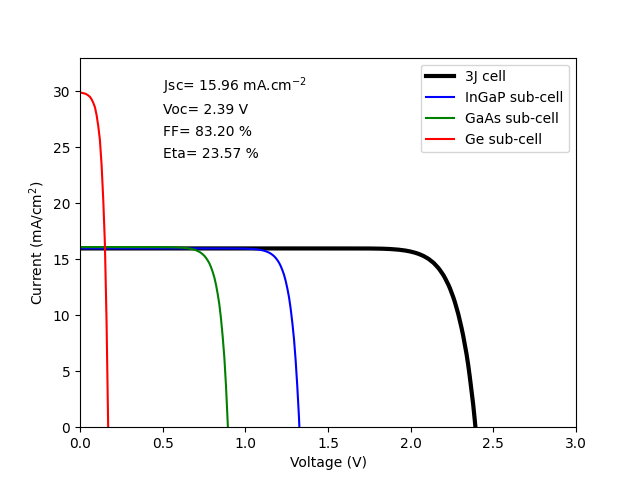
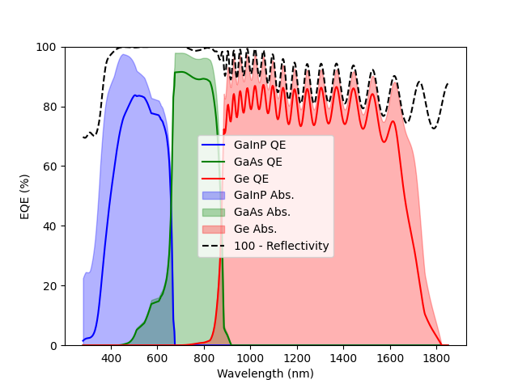

Example of a 3J solar cell calculated with the DA solver
=========================================================

- Required extra files, available in `Solcore's Github repository (Examples folder) <https://github.com/dalonsoa/solcore5>`_:

    - MgF-ZnS_AR.csv
    - in01gaas.csv
    - Ge-Palik.csv

.. code-block:: Python

    import numpy as np
    import matplotlib.pyplot as plt

    from solcore import siUnits, material, si
    from solcore.interpolate import interp1d
    from solcore.solar_cell import SolarCell
    from solcore.structure import Junction, Layer
    from solcore.solar_cell_solver import solar_cell_solver

    all_materials = []

    def this_dir_file(f):
        from pathlib import Path
        return str(Path(__file__).parent / "data" /  f)

    # We need to build the solar cell layer by layer.
    # We start from the AR coating. In this case, we load it from an an external file
    refl_nm = np.loadtxt(this_dir_file("MgF-ZnS_AR.csv"), unpack=True, delimiter=",")
    ref = interp1d(x=siUnits(refl_nm[0], "nm"), y=refl_nm[1], bounds_error=False, fill_value=0)

    # TOP CELL - GaInP
    # Now we build the top cell, which requires the n and p sides of GaInP and a window layer.
    # We also load the absorption coefficient from an external file. We also add some extra parameters needed for the
    # calculation such as the minority carriers diffusion lengths
    AlInP = material("AlInP")
    InGaP = material("GaInP")
    window_material = AlInP(Al=0.52)
    top_cell_n_material = InGaP(In=0.49, Nd=siUnits(2e18, "cm-3"), hole_diffusion_length=si("200nm"))
    top_cell_p_material = InGaP(In=0.49, Na=siUnits(1e17, "cm-3"), electron_diffusion_length=si("1um"))

    all_materials.append(window_material)
    all_materials.append(top_cell_n_material)
    all_materials.append(top_cell_p_material)

    # MID CELL  - InGaAs
    # We add manually the absorption coefficient of InGaAs since the one contained in the database doesn't cover
    # enough range, keeping in mind that the data has to be provided as a function that takes wavelengths (m) as input and
    # returns absorption (1/m)
    InGaAs = material("InGaAs")
    InGaAs_alpha = np.loadtxt(this_dir_file("in01gaas.csv"), unpack=True, delimiter=",")
    InGaAs.alpha = interp1d(x=1240e-9 / InGaAs_alpha[0][::-1], y=InGaAs_alpha[1][::-1], bounds_error=False, fill_value=0)

    mid_cell_n_material = InGaAs(In=0.01, Nd=siUnits(3e18, "cm-3"), hole_diffusion_length=si("500nm"))
    mid_cell_p_material = InGaAs(In=0.01, Na=siUnits(1e17, "cm-3"), electron_diffusion_length=si("5um"))

    all_materials.append(mid_cell_n_material)
    all_materials.append(mid_cell_p_material)

    # BOTTOM CELL - Ge
    # We add manually the absorption coefficient of Ge since the one contained in the database doesn't cover
    # enough range.
    Ge = material("Ge")
    Ge_alpha = np.loadtxt(this_dir_file("Ge-Palik.csv"), unpack=True, delimiter=",")
    Ge.alpha = interp1d(x=1240e-9 / Ge_alpha[0][::-1], y=Ge_alpha[1][::-1], bounds_error=False, fill_value=0)

    bot_cell_n_material = Ge(Nd=siUnits(2e18, "cm-3"), hole_diffusion_length=si("800nm"))
    bot_cell_p_material = Ge(Na=siUnits(1e17, "cm-3"), electron_diffusion_length=si("50um"))

    all_materials.append(bot_cell_n_material)
    all_materials.append(bot_cell_p_material)

    # We add some other properties to the materials, assumed the same in all cases, for simplicity.
    # If different, we should have added them above in the definition of the materials.
    for mat in all_materials:
        mat.hole_mobility = 5e-2
        mat.electron_mobility = 3.4e-3
        mat.hole_mobility = 3.4e-3
        mat.electron_mobility = 5e-2
        mat.relative_permittivity = 9

    # And, finally, we put everything together, adding also the surface recombination velocities. We also add some shading
    # due to the metallisation of the cell = 8%, and indicate it has an area of 0.7x0.7 mm2 (converted to m2)
    solar_cell = SolarCell(
        [
            Junction([Layer(si("25nm"), material=window_material, role='window'),
                      Layer(si("100nm"), material=top_cell_n_material, role='emitter'),
                      Layer(si("600nm"), material=top_cell_p_material, role='base'),
                      ], sn=1, sp=1, kind='DA'),
            Junction([Layer(si("200nm"), material=mid_cell_n_material, role='emitter'),
                      Layer(si("3000nm"), material=mid_cell_p_material, role='base'),
                      ], sn=1, sp=1, kind='DA'),
            Junction([Layer(si("400nm"), material=bot_cell_n_material, role='emitter'),
                      Layer(si("100um"), material=bot_cell_p_material, role='base'),
                      ], sn=1, sp=1, kind='DA'),
        ], reflectivity=ref, shading=0.08, cell_area=0.7 * 0.7 / 1e4)

    wl = np.linspace(300, 1800, 700) * 1e-9
    solar_cell_solver(solar_cell, 'qe', user_options={'wavelength': wl})

    plt.figure(1)
    plt.plot(wl * 1e9, solar_cell[0].eqe(wl) * 100, 'b', label='GaInP')
    plt.plot(wl * 1e9, solar_cell[1].eqe(wl) * 100, 'g', label='InGaAs')
    plt.plot(wl * 1e9, solar_cell[2].eqe(wl) * 100, 'r', label='Ge')

    plt.legend()
    plt.ylim(0, 100)
    plt.ylabel('EQE (%)')
    plt.xlabel('Wavelength (nm)')

    V = np.linspace(0, 3, 300)
    solar_cell_solver(solar_cell, 'iv', user_options={'voltages': V, 'light_iv': True, 'wavelength': wl})

    plt.figure(2)
    plt.plot(V, solar_cell.iv['IV'][1], 'k', linewidth=3, label='Total')
    plt.plot(V, -solar_cell[0].iv(V), 'b', label='GaInP')
    plt.plot(V, -solar_cell[1].iv(V), 'g', label='InGaAs')
    plt.plot(V, -solar_cell[2].iv(V), 'r', label='Ge')

    plt.legend()
    plt.ylim(0, 200)
    plt.xlim(0, 3)
    plt.ylabel('Current (A/m$^2$)')
    plt.xlabel('Voltage (V)')

    plt.show()
