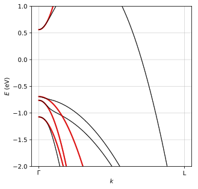
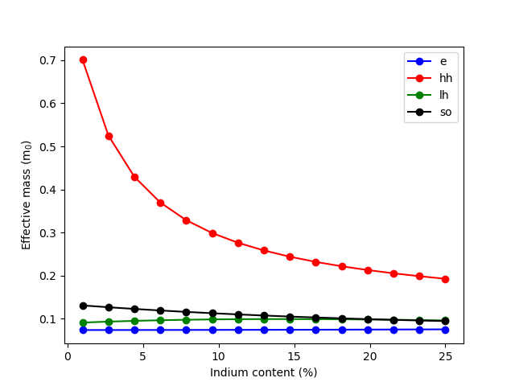

KP calculator and effective mass fitting
========================================

.. code-block:: Python

    import numpy as np
    import matplotlib.pyplot as plt

    from solcore import material
    from solcore.constants import electron_mass
    from solcore.quantum_mechanics import kp_bands

    # Material parameters
    GaAs = material("GaAs")(T=300)
    InGaAs = material("InGaAs")

    # As a test, we solve the problem for an intermediate indium composition
    InGaAs2 = InGaAs(In=0.15, T=300)
    masses = kp_bands(InGaAs2, GaAs, graph=True, fit_effective_mass=True, effective_mass_direction="L", return_so=True)

    comp = np.linspace(0.01, 0.25, 15)
    me = []
    mhh = []
    mlh = []
    mso = []
    for i in comp:
        InGaAs2 = InGaAs(In=i, T=300)

        # Set graph = True to see the fitting of the bands
        c, hh, lh, so, m_eff_c, m_eff_hh, m_eff_lh, m_eff_so = kp_bands(InGaAs2, GaAs, graph=False, fit_effective_mass=True,
                                                                        effective_mass_direction="L", return_so=True)

        me.append(m_eff_c / electron_mass)
        mhh.append(m_eff_hh / electron_mass)
        mlh.append(m_eff_lh / electron_mass)
        mso.append(m_eff_so / electron_mass)

        print('Effective masses for In = {:2.3}%:'.format(i * 100))
        print('- m_e = {:1.3f} m0'.format(me[-1]))
        print('- m_hh = {:1.3f} m0'.format(mhh[-1]))
        print('- m_lh = {:1.3f} m0'.format(mlh[-1]))
        print('- m_so = {:1.3f} m0'.format(mso[-1]))
        print()

    plt.plot(comp * 100, me, 'b-o', label='e')
    plt.plot(comp * 100, mhh, 'r-o', label='hh')
    plt.plot(comp * 100, mlh, 'g-o', label='lh')
    plt.plot(comp * 100, mso, 'k-o', label='so')

    plt.xlabel("Indium content (%)")
    plt.ylabel("Effective mass (m$_0$)")
    plt.legend()
    plt.show()
