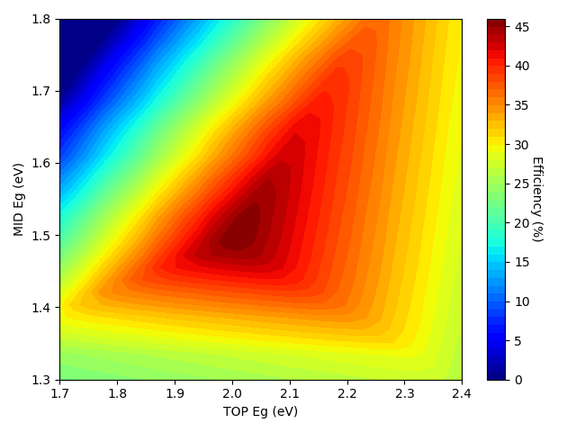
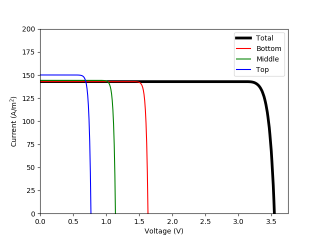

Example of using the DB solver to calculate the efficiency map of a 3J solar cell
=================================================================================

.. code-block:: Python

    import numpy as np
    import matplotlib.pyplot as plt
    from matplotlib import cm

    from solcore.light_source import LightSource
    from solcore.solar_cell import SolarCell
    from solcore.solar_cell_solver import solar_cell_solver
    from solcore.structure import Junction

    # Illumination spectrum
    wl = np.linspace(300, 4000, 4000) * 1e-9
    light = LightSource(source_type='standard', version='AM1.5g', x=wl, output_units='photon_flux_per_m')

    T = 298
    V = np.linspace(0, 5, 500)

    # This function assembles the solar cell and calculates the IV cruve
    def solve_MJ(EgBot, EgMid, EgTop):
        db_junction0 = Junction(kind='DB', T=T, Eg=EgBot, A=1, R_shunt=np.inf, n=1)
        db_junction1 = Junction(kind='DB', T=T, Eg=EgMid, A=1, R_shunt=np.inf, n=1)
        db_junction2 = Junction(kind='DB', T=T, Eg=EgTop, A=1, R_shunt=np.inf, n=1)
        # n is the ideality factor of the diode. It is 1 for a perfect diode, but can be higher for a real diode.

        my_solar_cell = SolarCell([db_junction2, db_junction1, db_junction0], T=T, R_series=0)

        solar_cell_solver(my_solar_cell, 'iv',
                          user_options={'T_ambient': T, 'db_mode': 'top_hat', 'voltages': V, 'light_iv': True,
                                        'internal_voltages': np.linspace(-6, 5, 1100), 'wavelength': wl,
                                        'mpp': True, 'light_source': light})

        return my_solar_cell

    # We create an efficiency map using Eg0 as the bandgap of the bottom junction and scanning the bandgaps of the middle
    # and top junctions
    N1 = 30
    N2 = 30
    Eg0 = 1.12

    all_Eg1 = np.linspace(1.3, 1.8, N1)
    all_Eg2 = np.linspace(1.7, 2.4, N2)
    eff = np.zeros((N1, N2))

    N = N1 * N2
    index = 0
    Effmax = -1
    Eg1_max = all_Eg1[0]
    Eg2_max = all_Eg2[0]

    # And we run the calculation
    for i, Eg1 in enumerate(all_Eg1):
        for j, Eg2 in enumerate(all_Eg2):

            my_solar_cell = solve_MJ(Eg0, Eg1, Eg2)
            mpp = my_solar_cell.iv.Pmpp

            eff[i, j] = mpp

            if mpp > Effmax:
                Effmax = mpp
                Eg1_max = Eg1
                Eg2_max = Eg2

            index += 1
            print(int(index / N * 100), '%\n')

    optimum_MJ = solve_MJ(Eg0, Eg1_max, Eg2_max)

    plt.figure(1)
    plt.plot(V, optimum_MJ.iv.IV[1], 'k', linewidth=4, label='Total')
    plt.plot(V, -optimum_MJ[0].iv(V), 'r', label='Bottom')
    plt.plot(V, -optimum_MJ[1].iv(V), 'g', label='Middle')
    plt.plot(V, -optimum_MJ[2].iv(V), 'b', label='Top')
    plt.ylim(0, 200)
    plt.xlim(0, 3.75)
    plt.legend()
    plt.xlabel('Voltage (V)')
    plt.ylabel('Current (A/m$^2$)')

    plt.figure(2)
    eff = eff / light.power_density * 100
    plt.contourf(all_Eg2, all_Eg1, eff, 50, cmap=cm.jet)
    plt.xlabel('TOP Eg (eV)')
    plt.ylabel('MID Eg (eV)')
    cbar = plt.colorbar()
    cbar.set_label('Efficiency (%)', rotation=270, labelpad=10)
    plt.tight_layout()
    plt.show()
