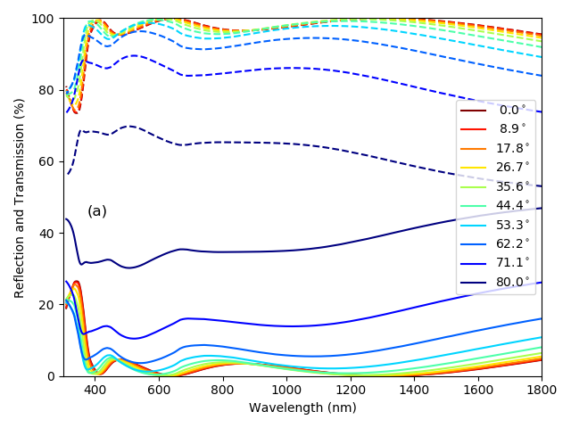

Using the TMM solver to calculate the reflection of a multilayered ARC
======================================================================

.. code-block:: Python

    import matplotlib.pyplot as plt
    import numpy as np
    from solcore.solar_cell import Layer
    from solcore.absorption_calculator import calculate_rat, OptiStack
    from solcore import material, si

    wl = np.linspace(300, 1900, 1000)

    MgF2 = material("MgF2")()
    HfO2 = material("HfO2")()
    ZnS = material("ZnScub")()
    AlInP = material("AlInP")(Al=0.52)
    GaInP = material("GaInP")(In=0.49)

    stack = OptiStack([
        Layer(si('141nm'), material=MgF2),
        Layer(si('82nm'), material=HfO2),
        Layer(si('70nm'), material=ZnS),
        Layer(si('25nm'), material=AlInP),
    ], substrate=GaInP, no_back_reflection=False)

    angles = np.linspace(0, 80, 10)
    RAT_angles = np.zeros((len(angles), 3, len(wl)))

    print("Calculate RAT:")
    for i, theta in enumerate(angles):
        print("Calculating at angle: %4.1f deg" % theta)
        # Calculate RAT data...
        rat_data = calculate_rat(stack, angle=theta, wavelength=wl,
                                 no_back_reflection=False)

        RAT_angles[i] = [rat_data["R"], rat_data["A"], rat_data["T"]]

    colors = plt.cm.jet(np.linspace(1, 0, len(RAT_angles)))

    fig, (ax1, ax2) = plt.subplots(1, 2, figsize=(10, 4))

    for i, RAT in enumerate(RAT_angles):
        if i == 0:
            ax1.plot(wl, RAT[0] * 100, ls="-", color=colors[i], label="R")
            ax1.plot(wl, (RAT[1] + RAT[2]) * 100, ls="--", color=colors[i], label="A+T")

        else:
            ax1.plot(wl, RAT[0] * 100, ls="-", color=colors[i])
            ax1.plot(wl, (RAT[1] + RAT[2]) * 100, ls="--", color=colors[i])

        ax2.plot(wl, RAT[1]*100, color=colors[i], label="%4.1f$^\circ$" % angles[i])

    ax1.set_ylim([0, 100])
    ax1.set_xlim([300, 1800])
    ax1.set_xlabel("Wavelength (nm)")
    ax1.set_ylabel("Reflection and transmission into structure (%)")
    ax1.legend(loc=5)

    ax2.set_ylim([0, 100])
    ax2.set_xlim([300, 1800])
    ax2.set_xlabel("Wavelength (nm)")
    ax2.set_ylabel("Absorption in surface layers (%)")
    ax2.legend(loc=5)

    plt.tight_layout()
    plt.show()