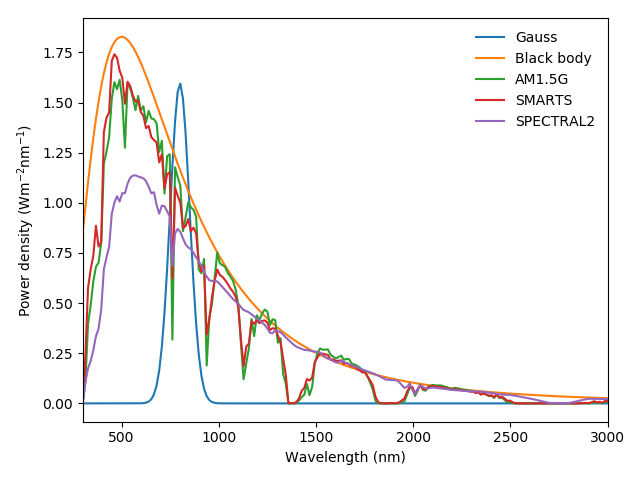
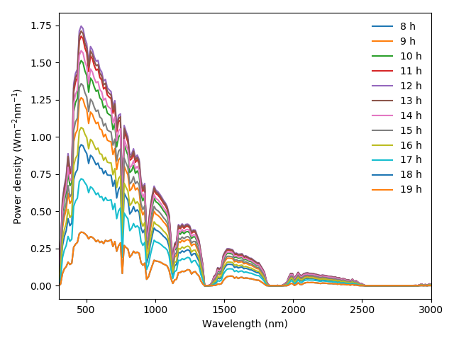

Example of the creation of light sources
========================================

**Note**: This script requires having SMARTS installed and correctly configured. If you do not have it, comment those lines related to the SMARTS light source.

.. code-block:: Python

    import numpy as np
    import matplotlib.pyplot as plt

    from solcore.light_source import LightSource

    # The wavelength range of the spectra
    wl = np.linspace(300, 3000, 200)

    # Now different types of light sources can be defined
    gauss = LightSource(source_type='laser', x=wl, center=800, linewidth=50, power=200)
    bb = LightSource(source_type='black body', x=wl, T=5800, entendue='Sun')
    am15g = LightSource(source_type='standard', x=wl, version='AM1.5g')
    smarts = LightSource(source_type='SMARTS', x=wl)
    spectral = LightSource(source_type='SPECTRAL2', x=wl)

    # Plot comparing the different light sources
    plt.figure(1)
    plt.plot(*gauss.spectrum(), label='Gauss')
    plt.plot(*bb.spectrum(), label='Black body')
    plt.plot(*am15g.spectrum(), label='AM1.5G')
    plt.plot(*smarts.spectrum(), label='SMARTS')
    plt.plot(*spectral.spectrum(), label='SPECTRAL2')

    plt.xlim(300, 3000)
    plt.xlabel('Wavelength (nm)')
    plt.ylabel('Power density (Wm$^{-2}$nm$^{-1}$)')
    plt.tight_layout()
    plt.legend()

    # Plot comparing the spectra calculated with SMARTS at different hours of the day
    plt.figure(2)
    for h in range(8, 20):
        plt.plot(*smarts.spectrum(HOUR=h), label='{} h'.format(h))

    plt.xlim(300, 3000)
    plt.xlabel('Wavelength (nm)')
    plt.ylabel('Power density (Wm$^{-2}$nm$^{-1}$)')
    plt.tight_layout()
    plt.legend()
    plt.show()

