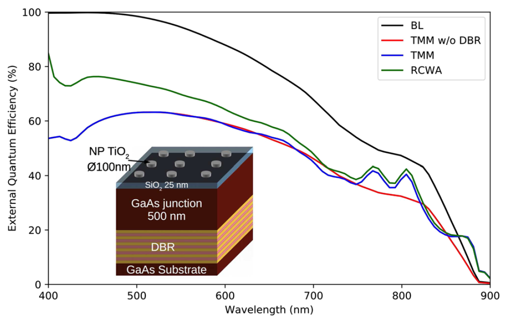

Comparison of Solcore's optical models
======================================================================

The different optical models in Solcore are suitable for different purposes. The Beer-Lambert (BL) model does not include front surface reflection,
unless it is externally specified, but is extremely fast and may be suitable for material stacks where the layers are optically thick
(especially if the front surface reflectivity is specified by the user, e.g. from measured data). The transfer matrix model (TMM)
deals with multi-layer interference correctly, and can be used at multiple incidence angles and either s, p, or unpolarized light.
Finally, the RCWA capability integrated in Solcore is the most advanced solver, capable of dealing with periodic structures.
For any multi-layer structures without diffracting layers, it gives the same results as the TMM solver. However, as the number
of diffraction orders used in the calculation increases, the computation time can become very significant.

The plot above shows the EQE results for a thin GaAs cell with various light-trapping structures, considered using
the different solvers. The structure is a relatively thin (500 nm) GaAs cell, with :math:`TiO_2` nanoparticles (NPs) on the front
and a distributed Bragg reflector (DBR) consisting of 10 GaAs/AlAs bilayers. The NP array is made up of disks 50 nm in height,
with 100 nm diameter and arranged in a square pattern with a period of 400 nm. A DBR is a selective reflector, in this case
designed to reflect light with wavelengths around 800 nm, close to the bandgap of GaAs where transmission losses would be highest.
The figure above shows that the simplest model, the BL law, does not give any front-surface reflection, with all the light absorbed
at short wavelengths. At longer wavelengths, there is some transmission into the GaAs substrate; although absorption in the DBR
will be calculated, the interference effects which lead to wavelength-selective reflection are ignored by the BL model.
The TMM model with the DBR removed from the structure shows a similar profile to the BL EQE, but significantly lower due
to reflection at the front surface. When the DBR is included, two clear new peaks in the EQE calculated using the TMM are
observed. Finally, when the full structure is modelled using RCWA, these peaks due to the DBR remain but the EQE at all
wavelengths is increased, due to an anti-reflection effect from the NPs and increased path length in the GaAs cell
due to diffraction effects.

.. code-block:: Python

    import numpy as np
    import matplotlib.pyplot as plt

    from solcore import si, material
    from solcore.structure import Junction, Layer
    from solcore.solar_cell import SolarCell
    from solcore.solar_cell_solver import solar_cell_solver, default_options
    from solcore.light_source import LightSource
    from solcore.constants import vacuum_permittivity
    from solcore.absorption_calculator import RCWASolverError

    # user options
    T = 298
    wl = si(np.linspace(400, 900, 80), 'nm')
    light_source = LightSource(source_type='standard', version='AM1.5g', x=wl,
                               output_units='photon_flux_per_m', concentration=1)
    opts = default_options
    opts.wavelength, opts.no_back_reflection, opts.size, opts.light_source, opts.T_ambient = \
        wl, False, ((400, 0), (0, 400)), light_source, T
    opts.recalculate_absorption = True
    # The size of the unit cell for the RCWA structure is 400 x 400 nm

    # Defining all the materials we need
    Air = material('Air')(T=T)
    p_GaAs = material('GaAs')(T=T, Na=si('4e18cm-3'))  # for the GaAs cell emitter
    n_GaAs = material('GaAs')(T=T, Nd=si('2e17cm-3'))  # for the GaAs cell base
    AlAs, GaAs = material('AlAs')(T=T), material('GaAs')(T=T)  # for the DBR
    SiO2 = material('SiO2', sopra=True)(T=T)  # for the spacer layer
    TiO2 = material('TiO2', sopra=True)(T=T)  # for the nanoparticles

    # some parameters for the QE solver
    for mat in [n_GaAs, p_GaAs]:
        mat.hole_mobility, mat.electron_mobility, mat.permittivity = 3.4e-3, 5e-2, 9 * vacuum_permittivity
        n_GaAs.hole_diffusion_length, p_GaAs.electron_diffusion_length = si("500nm"), si("5um")

    # Define the different parts of the structure we will use. For the GaAs junction, we use the depletion approximation
    GaAs_junction = [Junction([Layer(width=si('100nm'), material=p_GaAs, role="emitter"),
                               Layer(width=si('400nm'), material=n_GaAs, role="base")], T=T, kind='DA')]

    # this creates 10 repetitions of the AlAs and GaAs layers, to make the DBR structure
    DBR = 10 * [Layer(width=si("73nm"), material=AlAs), Layer(width=si("60nm"), material=GaAs)]

    # The layer with nanoparticles
    NP_layer = [Layer(si('50nm'), Air, geometry=[{'type': 'circle', 'mat': TiO2, 'center': (200, 200),
                                                  'radius': 50}])]

    substrate = [Layer(width=si('50um'), material=GaAs)]
    spacer = [Layer(width=si('25nm'), material=SiO2)]

    # --------------------------------------------------------------------------
    # solar cell with SiO2 coating
    solar_cell = SolarCell(spacer + GaAs_junction + substrate)

    opts.optics_method = 'TMM'
    solar_cell_solver(solar_cell, 'qe', opts)
    TMM_EQE = solar_cell[1].eqe(opts.wavelength)

    opts.optics_method = 'BL'
    solar_cell_solver(solar_cell, 'qe', opts)
    BL_EQE = solar_cell[1].eqe(opts.wavelength)

    # --------------------------------------------------------------------------
    # as above, with a DBR on the back
    solar_cell = SolarCell(spacer + GaAs_junction + DBR + substrate)

    opts.optics_method = 'TMM'
    solar_cell_solver(solar_cell, 'qe', opts)
    TMM_EQE_DBR = solar_cell[1].eqe(opts.wavelength)

    # --------------------------------------------------------------------------
    # cell with TiO2 nanocylinder array on the front
    solar_cell = SolarCell(NP_layer + spacer + GaAs_junction + DBR + substrate)

    opts.optics_method = 'TMM'
    solar_cell_solver(solar_cell, 'qe', opts)
    TMM_EQE_NP = solar_cell[2].eqe(opts.wavelength)

    opts.optics_method = 'BL'
    solar_cell_solver(solar_cell, 'qe', opts)
    BL_EQE_NP = solar_cell[2].eqe(opts.wavelength)

    try:
        opts.optics_method = 'RCWA'
        opts.orders = 19  # number of diffraction orders to keep in the RCWA solver
        solar_cell_solver(solar_cell, 'qe', opts)
        RCWA_EQE_NP = solar_cell[2].eqe(opts.wavelength)
        RCWA_legend = 'RCWA (GaAs SC + NP array + DBR)'
    except RCWASolverError:
        RCWA_EQE_NP = np.zeros_like(BL_EQE_NP)
        RCWA_legend = '(RCWA solver S4 not available)'

    plt.figure()
    plt.plot(wl * 1e9, BL_EQE_NP, wl * 1e9, TMM_EQE, wl * 1e9, TMM_EQE_DBR, wl * 1e9, RCWA_EQE_NP)
    plt.legend(labels=['Beer-Lambert law (all structures)', 'TMM (GaAs SC)', 'TMM (GaAs SC + DBR)',
                       RCWA_legend])
    plt.xlabel("Wavelength (nm)")
    plt.ylabel("Quantum efficiency")
    plt.show()
