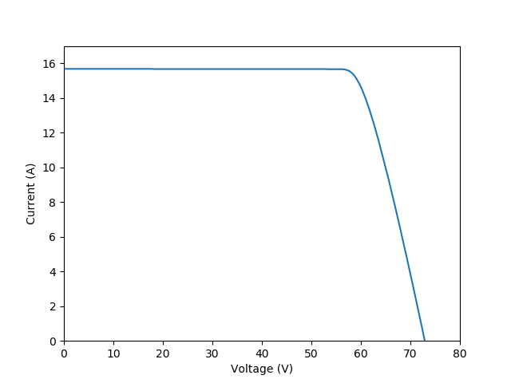
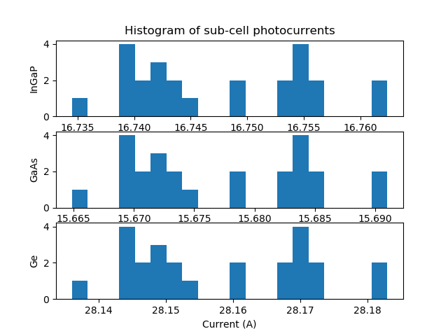

Example of a PV solar array
===========================

.. code-block:: Python

    import numpy as np
    import matplotlib.pyplot as plt

    from solcore.solar_cell import SolarCell
    from solcore.light_source import LightSource
    from solcore.spice.pv_module_solver import solve_pv_module
    from solcore.structure import Junction

    T = 298

    # First we define the properties of the MJ solar cell that the solar module is made of. We use junctions of kind 2-diode
    db_junction = Junction(kind='2D', T=T, reff=1, jref=300, Eg=0.66, A=1, R_series=0.00236, R_shunt=1e14, n=3.5)
    db_junction2 = Junction(kind='2D', T=T, reff=1, jref=300, Eg=1.4, A=1, R_series=0.00012, R_shunt=1e14, n=3.5)
    db_junction3 = Junction(kind='2D', T=T, reff=1, jref=300, Eg=1.9, A=1, R_series=8.0e-5, R_shunt=1e14, n=3.5)

    my_solar_cell = SolarCell([db_junction3, db_junction2, db_junction], T=T, R_series=0.0, area=0.1)

    wl = np.linspace(350, 2000, 301) * 1e-9
    light_source = LightSource(source_type='standard', version='AM1.5g', x=wl, output_units='photon_flux_per_m',
                               concentration=1)

    options = {'light_iv': True, 'wavelength': wl, 'light_source': light_source}

    # After defining the individual solar cell, we solve the module IV characteristics adding some dispersion in the
    # values of the short circuit currents.
    voltage, current, all_Isc_values, raw_data = solve_pv_module(my_solar_cell, options, jscSigma=0.02)

    plt.figure(1)

    plt.subplot(311)
    plt.title('Histogram of sub-cell photocurrents')
    plt.ylabel('InGaP')
    plt.hist(([row[0] for row in all_Isc_values]), bins=20)

    plt.subplot(312)
    plt.hist(([row[1] for row in all_Isc_values]), bins=20)
    plt.ylabel('GaAs')

    plt.subplot(313)
    plt.xlabel('Current (A)')
    plt.ylabel('Ge')
    plt.hist(([row[2] for row in all_Isc_values]), bins=20)

    plt.figure(2)
    plt.plot(voltage, current)
    plt.xlabel('Voltage (V)')
    plt.ylabel('Current (A)')
    plt.xlim(0, 80)
    plt.ylim(0, 17)

    plt.show()
