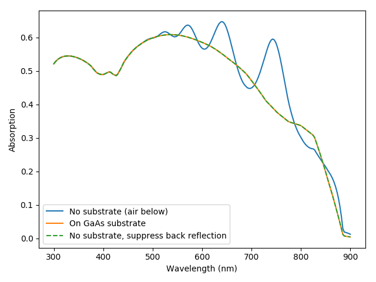
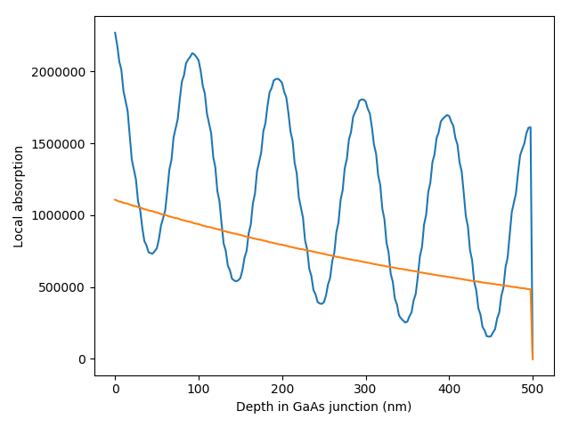

Looking at the effect of substrate and the no_back_reflection option in the TMM solver
=====================================================================================

.. code-block:: Python

	# TMM and RCWA solvers can take into account the presence of a substrate if it is specified in the solar_cell object.
	# This example illustrates this for the TMM solver.

	from solcore import material
	from solcore import si
	import matplotlib.pyplot as plt
	import numpy as np
	from solcore.solar_cell import default_GaAs, SolarCell, Layer, Junction
	from solcore.solar_cell_solver import solar_cell_solver
	from solcore.absorption_calculator import OptiStack

	T = 298

	GaAs = material('GaAs')(T = T)

	thin_GaAs = SolarCell([Layer(material = GaAs, width=si('500nm'))])

	GaAs_on_substrate = SolarCell([Layer(material = GaAs, width=si('500nm'))], substrate = GaAs)

	wl = si(np.linspace(300, 900, 200), 'nm')

	# Thin solar cell, no substrate - will get significant absorption enhancement from reflection at the GaAs/air interface at the back
	# MUST specify no_back_reflection = False, so that Solcore does not automatically suppress reflections from the back
	# (currently, the default setting in solcore is to suppress reflections from the back, so no_back_reflection = True)
	solar_cell_solver(thin_GaAs, 'optics', user_options={'wavelength': wl, 'optics_method': 'TMM', 'no_back_reflection': False})
	z_pos = np.linspace(0, thin_GaAs.width, 201)
	profiles_thin = thin_GaAs[0].absorbed(z_pos)
	# Same thin solar cell, but now on a GaAs substrate. In this case, we get the same result whether or not we specify
	# no_back_reflection to be True or False, since with a GaAs on GaAs cell we don't get any reflection at the back interface anyway
	solar_cell_solver(GaAs_on_substrate, 'optics', user_options={'wavelength': wl, 'optics_method': 'TMM'})
	profiles_thick = GaAs_on_substrate[0].absorbed(z_pos)

	plt.figure()
	plt.plot(wl * 1e9,  thin_GaAs[0].layer_absorption)
	plt.plot(wl * 1e9,  GaAs_on_substrate[0].layer_absorption)

	# Now we consider the thin solar cell without substrate again but ask Solcore to suppress back reflections. We must also
	# ask Solcore to recalculate the absorption, otherwise it will just use the results calculated above which are already
	# in the thin_GaAs object
	# What no_back_reflection = True actually does is add a highly absorbing layer based on the final layer in the stack so that
	# nothing is reflected.

	solar_cell_solver(thin_GaAs, 'optics', user_options={'wavelength': wl, 'optics_method': 'TMM', 'no_back_reflection': True,
														 'recalculate_absorption': True})

	plt.plot(wl * 1e9,  thin_GaAs[0].layer_absorption, '--')
	plt.legend(labels=['No substrate (air below)', 'On GaAs substrate', 'No substrate, suppress back reflection'])
	plt.xlabel("Wavelength (nm)")
	plt.ylabel("Absorption")
	plt.show()
	# we can see that, correctly, the results for the cell with an explicitly specified GaAs substrate and for the thin
	# cell purposely suppressing back reflections are the same, while the thin cell with back reflections shows thin-film
	# oscillations in the absorption spectrum.

	# Let's look at what the absorption profile looks like...

	# absorption profile around 750 nm incident wavelength:
	plt.figure()
	plt.plot(z_pos*1e9, profiles_thin[:,150])
	plt.plot(z_pos*1e9, profiles_thick[:,150])
	plt.xlabel("Depth in GaAs junction (nm)")
	plt.show()

