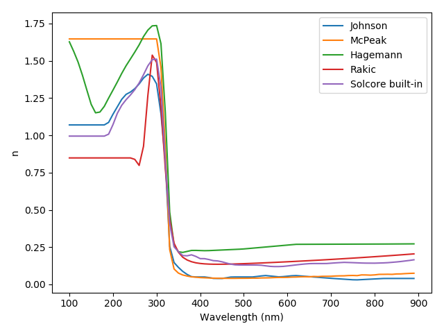
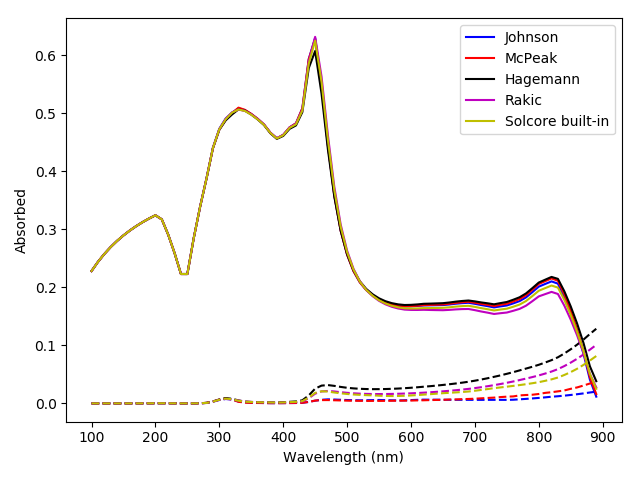

Searching the refractiveindex.info database and comparing materials
===================================================================

.. image:: Ag_k.png
   :width: 40%

.. code-block:: Python

	from solcore.absorption_calculator.nk_db import download_db, search_db
	from solcore import material
	from solcore import si
	from solcore.solar_cell import SolarCell
	from solcore.structure import Layer
	from solcore.solar_cell_solver import solar_cell_solver, default_options

	import numpy as np
	import matplotlib.pyplot as plt

	wl = si(np.arange(100, 900, 10), 'nm')

	opts = default_options
	opts.optics_method = 'TMM'
	opts.wavelength = wl

	# Download the database from refractiveindex.info. This only needs to be done once.
	# Can specify the source URL and number of interpolation points.
	# download_db()

	# Can search the database to select an appropriate entry. Search by element/chemical formula.
	# In this case, look for silver.

	search_db('Ag', exact = True)
	# This prints out, line by line, matching entries. This shows us entries with
	# "pageid"s 0 to 14 correspond to silver.

    # Let's compare the optical behaviour of some of those sources:
    # (The pageid values listed are for the 2021-07-18 version of the refractiveindex.info database)
    # pageid = 0, Johnson
    # pageid = 2, Jiang
    # pageid = 4, McPeak
    # pageid = 10, Hagemann
    # pageid = 14, Rakic (BB)

    # create instances of materials with the optical constants from the database.
    # The name (when using Solcore's built-in materials, this would just be the
    # name of the material or alloy, like 'GaAs') is the pageid, AS A STRING, while
    # the flag nk_db must be set to True to tell Solcore to look in the previously
    # downloaded database from refractiveindex.info
    Ag_Joh = material(name='0', nk_db=True)()
    Ag_Jia = material(name='2', nk_db=True)()
    Ag_McP = material(name='4', nk_db=True)()
    Ag_Hag = material(name='10', nk_db=True)()
    Ag_Rak = material(name='14', nk_db=True)()
    Ag_Sol = material(name='Ag')() # Solcore built-in (from SOPRA)

    names = ['Johnson', 'Jiang', 'McPeak', 'Hagemann', 'Rakic', 'Solcore built-in']

    plt.figure(figsize=(8,4))
    plt.subplot(121)
    plt.plot(wl*1e9, np.array([Ag_Joh.n(wl), Ag_Jia.n(wl), Ag_McP.n(wl),
                               Ag_Hag.n(wl), Ag_Rak.n(wl), Ag_Sol.n(wl)]).T)
    plt.legend(labels=names)
    plt.xlabel("Wavelength (nm)")
    plt.title("(2) $n$ and $\kappa$ values for Ag from different literature sources")
    plt.ylabel("n")

    plt.subplot(122)
    plt.plot(wl*1e9, np.array([Ag_Joh.k(wl), Ag_Jia.k(wl), Ag_McP.k(wl),
                               Ag_Hag.k(wl), Ag_Rak.k(wl), Ag_Sol.k(wl)]).T)
    plt.legend(labels=names)
    plt.xlabel("Wavelength (nm)")
    plt.ylabel("k")
    plt.show()

    # Compare performance as a back mirror on a GaAs 'cell'

    # Solid line: absorption in GaAs
    # Dashed line: absorption in Ag

    GaAs = material('GaAs')()

    colors = ['k', 'r', 'g', 'y', 'b', 'm']

    plt.figure()
    for c, Ag_mat in enumerate([Ag_Joh, Ag_Jia, Ag_McP, Ag_Hag, Ag_Rak, Ag_Sol]):
        my_solar_cell = OptiStack([Layer(width=si('50nm'), material = GaAs)], substrate=Ag_mat)
        RAT = calculate_rat(my_solar_cell, wl*1e9, no_back_reflection=False)
        GaAs_abs = RAT["A_per_layer"][1]
        Ag_abs = RAT["T"]
        plt.plot(wl*1e9, GaAs_abs, color=colors[c], linestyle='-', label=names[c])
        plt.plot(wl*1e9, Ag_abs, color=colors[c], linestyle='--')

    plt.legend()
    plt.xlabel("Wavelength (nm)")
    plt.ylabel("Absorbed")
    plt.title("(3) Absorption in GaAs depending on silver optical constants")
    plt.show()

