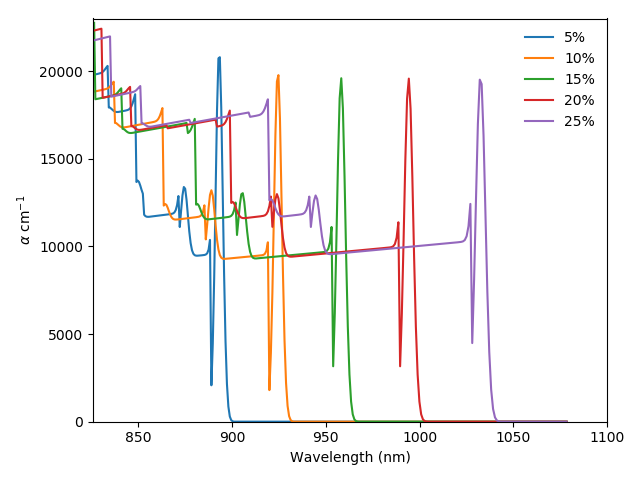

Absorption of quantum wells
===========================

For modelling the optical properties of QWs we use the method described
by S. Chuang ([#Ref18]_). The absorption
coefficient at thermal equilibrium in a QW is given by:

.. math::

   \label{eq:QW_abs2}
   \begin{split}
   \alpha_0(E) & = C_0(E) \sum_{n,m} |I_{hm}^{en}|^2 | \hat{e} \cdot \vec{p} |^2 \rho_{rmn}^{2D} \\
   & \times \left[ H(E-E^{en} + E_{hm}) + F_{nm}(E) \right]
   \end{split}

where :math:`|I_{hm}^{en}|^2` is the overlap integral between the holes
in level :math:`m` and the electrons in level :math:`n`; :math:`H` is a
step function, :math:`H(x)` = 1 for :math:`x>0`, 0 and 0 for
:math:`x<0`, :math:`\rho_{rmn}^{2D}` is the 2D joint density of states,
:math:`C_0` a proportionality constant dependent on the energy, and
:math:`F` the excitonic contribution, which will be discussed later.

.. math::

   \begin{aligned}
   \label{eq:qw_abs}
   C_0 (E) & =    \frac{\pi q^2 \hbar }{n_r c \epsilon_0 m_0^2 E} \\
   \rho_r^{2D} &= \frac{m_{rmn}^*}{\pi \hbar L}\end{aligned}

Here, :math:`n_r` is the refractive index of the material,
:math:`m_{rmn} = m_{en} m_{hm} / (m_{en} + m_{hm})` the reduced,
in-plane, effective mass and :math:`L` an effective period of the
quantum wells. The in-plane effective mass of each type of carriers is
calculated for each level, accounting for the spread of the wavefunction
into the barriers as ([#Ref19]_):

.. math::

   \begin{aligned}
   \label{eq:in_plane}
   m_{\perp} =  \int_{0}^{L} m(z) | \psi(z) |^2\end{aligned}

This in-plane effective mass is also used to calculate the local density
of states shown in Figure [fig:qw]b. In Eq. [eq:QW\_abs2],
:math:`| \hat{e} \cdot \vec{p} |^2` is the momentum matrix element,
which depends on the polarization of the light and on the Kane’s energy
:math:`E_p`, specific to each material and determined experimentally.
For band edge absorption, where :math:`k` = 0, the matrix elements for
the absorption of TE and TM polarized light for the transitions
involving the conduction band and the heavy and light holes bands are
given in Table [tab:matrix\_elements]. As can be deduced from this
table, transitions involving heavy holes cannot absorb TM polarised
light.

+----------------+---------------------+-------------------+
|                | TE                  | TM                |
+================+=====================+===================+
| :math:`c-hh`   | :math:`3/2 M_b^2`   | 0                 |
+----------------+---------------------+-------------------+
| :math:`c-lh`   | :math:`1/2 M_b^2`   | :math:`2 M_b^2`   |
+----------------+---------------------+-------------------+

Table: Momentum matrix elements for transitions in QWs.
:math:`M_b^2=m_0 E_p /6` is the bulk matrix element.

In addition to the band-to-band transitions, QWs usually have strong
excitonic absorption, included in Eq. [eq:qw\_abs] in the term
:math:`F_{nm}`. This term is a Lorenzian (or Gaussian) defined by an
energy :math:`E_{nmx, j}` and oscillator strength :math:`f_{ex, j}`. It
is zero except for :math:`m=n \equiv j` where it is given by Klipstein
et al. ([#Ref20]_):

.. math::

   \begin{aligned}
   F_{nm} &= f_{ex, j} \mathcal{L}(E - E_{nmx, j}, \sigma) \\
   E_{nmx, j} &= E^{en} - E_{hm} - \frac{R}{(j-\nu)^2} \\
   f_{ex, j} &= \frac{2R}{(j-\nu)^3} \\
   R &= \frac{m_r q^4}{2 ( 4\pi \epsilon_r \epsilon_0)^2 \hbar^2 }\end{aligned}

Here, :math:`\nu` is a constant with a value between 0 and 0.5 and
:math:`\sigma` is the width of the Lorentzian, both often adjusted to
fit some experimental data. In Solcore, they have default values of
:math:`\nu` = 0.15 and :math:`\sigma` = 6 meV. :math:`R` is the exciton
Rydberg energy ([#Ref18]_).

Fig. [fig:QW\_absorption] shows the absorption coefficient of a range of
InGaAs/GaAsP QWs with a GaAs interlayer and different In content. Higher
indium content increases the depth of the well, allowing the absorption
of less energetic light and more transitions.

.. automodule:: solcore.absorption_calculator.absorption_QW
    :members:

References
----------

.. [#Ref18] Chuang, S.L.: Physics of Optoelectronic Devices. Wiley- Interscience, New York (1995)
.. [#Ref19] Barnham, K., Vvedensky, D. (eds.): Low-Dimensional Semi- conductor Structures: Fundamentals and Device Applications. Cambridge University Press, Cambridge (2001)
.. [#Ref20] Klipstein, P.C., Apsley, N.: A theory for the electroreflectance spec- tra of quantum well structures. J. Phys. C Solid State Phys. 19(32), 6461–6478 (2000)