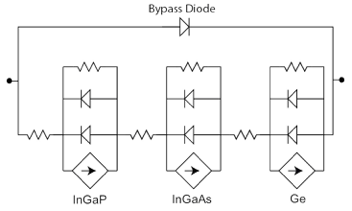

Solar array model
=================

- Example: :doc:`PV module calculator <../Examples/example_pv_module>`

The ability to use Solcore to build a SPICE equivalent circuit allows
entire PV systems to be simulated from the bottom
up. Each photovoltaic solar cell is described
using an equivalent circuit which can then be arranged in strings of
series and parallel cells to represent the entire system. An example for
a triple junction solar cell, complete with a bypass diode is shown in
figure [fig:3J\_equiv\_curcuit]; this unit is the basic building block
for a concentrator PV module.

The diode and resistance values for the equivalent circuit are
determined from solar cell testing, while the current source is
evaluated by integrating the product of the spectral irradiance
(estimated using an appropriate radiative transfer code e.g. SPCTRAL2 or
SMARTS) and the quantum efficiency which in turn can be calculated
dynamically as a function of temperature by
Solcore.

Since the entire module (and subsequently the system) is assembled from
individual solar cell components, it is possible (and indeed, necessary)
to distribute the component values to accommodate for manufacturing
tolerances. This enables a close match between the modelled output power
and that measured experimentally and has been used to determine how both
aerosols and precipitable water affect the electricity yield from
concentrator PV systems.
Where system IV data is available, the emergence of electrical faults,
(e.g. shunts or shading) can also be accounted
for.

PV module solver functions
--------------------------

.. automodule:: solcore.spice.pv_module_solver
    :members:
    :undoc-members:
