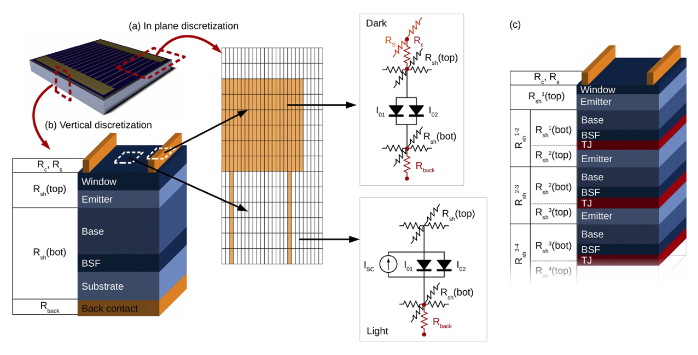

Quasi-3D solar cell solver
==========================

- Example: :doc:`Quasi-3D 3J solar cell <../Examples/example_quasi3D_cell>`

The quasi-3D solar cell model included in Solcore uses a SPICE-based electrical network to model the flow of injected current through the solar cell. The plane of the cell is discretized into many elements, each of them representing a small portion of the cell. Depending on the location of the element - exposed to the sunlight or underneath a metal finger - the IV curve of the cell will be the light IV or the dark IV. Each element is linked to their neighbours with resistors, representing the lateral current flow and dependent on the sheet resistance of the cells. This method can be applied to any number of junctions.

This type of formalism is widely used to simulate the performance of solar cells when the effect of a spatial variable needs to be incorporated in the model. This variable can be the design of the front metal grid, in order to minimise the effect of series resistances; the inhomogeneous illumination profile in concentrator devices; the impact of such inhomogeneity on the transport through the tunnel junctions; or the distribution of defects or inhomogeneities. Recently, this formalism was used to model the photoluminescence and the electroluminescence based IV curves of MJ devices, accounting for the limited lateral carrier transport.

Specifically for the modelling and optimization of the front grid of solar cells in order to minimise shading losses and series resistance, there are two packages already available: `PVMOS <https://github.com/IEK-5/PVMOS>`_, developed by B. E. Pieters in C and released as open source, and `Griddler <https://www.pvlighthouse.com.au/cms/simulation-programs/griddler>`_, developed by J. Wong using Matlab and available at PV Lighthouse.

In-plane discretization
-----------------------

There are two regions in the plane: the metal and the aperture. These two are provided to Solcore as
grey scale images that will work as masks. The resolution of the images,
in pixels, will define the in-plane discretization. By default, the
aspect ratio of the pixels in the image will be 1:1, but this can be set
to a different value in order to reduce the number of elements and
improve speed. For example, the in-plane discretization of Fig.
[fig:spice\_overview]a has an aspect ratio :math:`A_r=L_y/L_x = 4`, with
:math:`L_x` and :math:`L_y` the pixel size in each direction.

The values
of the pixels in the metal mask are <55 where there is no metal (the
aperture area), >200 where there is metal and the external electrical
contacts (the boundaries with fixed, externally set voltage values) and
any other value in between to represent regions with metal but not fixed
voltage. The pixels of the illumination mask - which become the aperture
mask after removing the areas shadowed by the metal - can have any value
between 0 and 255. These values divided by 255 will indicate the
intensity of the sunlight at that pixel relative to the maximum
intensity.

The minimum total number of nodes where SPICE will need to calculate the
voltages will be
N\ :math:`\times`\ M\ :math:`\times`\ 2\ :math:`\times`\ Q, with N and M
the number of pixels in both in-plane directions and Q the number of
junctions, which require 2 nodes each. To this, the front and back metal
contacts could add a maximum of 2(N\ :math:`\times`\ M) nodes. Exploiting
symmetries of the problem as well as choosing an appropriate pixel
aspect ratio will significantly reduce the number of nodes and therefore
the time required for the computation of the problem.

Vertical discretization
-----------------------

First, the solar cell is solved in order to obtain the parameters for the 2-diode
model at the given illumination conditions. These parameters are then
used to replicate the 2-diode model in SPICE. The :math:`I_{SC}` is
scaled in each pixel by the intensity of the illumination given by the
illumination mask. Sheet resistances above and below each junction,
:math:`R_{sh}(top)` and :math:`R_{sh}(bot)`, account for the lateral
transport. Beneath the metal, there is no current source, as the region
is in the dark, and there are extra resistances accounting for the
contact between the metal and the semiconductor :math:`R_c` and the
transport along the metal finger :math:`R_s`. Given that the pixels can be
asymmetric, these resistances need to be defined in both in-plane
directions, :math:`x` and :math:`y`:

.. math::

   \begin{aligned}
   R_{sh}^x &= \frac{1}{A_r} R_{sh} \\
   R_{sh}^y &= A_r R_{sh} \\
   R_s^x &= \frac{1}{hA_r} \rho_m \\
   R_s^y &= \frac{A_r}{h} \rho_m \\
   R_c &= R_{back} = \frac{1}{L_x^2 A_r} \rho_c\end{aligned}

where :math:`h` is the height of the metal, :math:`\rho_m` their linear
resistivity and :math:`\rho_c` the contact resistivity between metal and
semiconductor. The sheet resistance of a stack of semiconductor layers
:math:`R_{sh}` is equal to the combination in parallel of the individual
sheet resistances. Using the single junction example of the figure, :math:`R_{sh}(top)` will be given by:

.. math:: \frac{1}{R_{sh}(top)} = \frac{1}{R_{sh}(window)} + \frac{1}{R_{sh}(emitter)}

Each of these can be estimated from the thickness of the layer
:math:`d`, the majority carrier mobility :math:`\mu` and the doping
:math:`N` as:

.. math:: \frac{1}{R_{sh}} = qd\mu N

If the solar cell has been defined using only the DA and PDD junction
models, this information is already available for all the layers of the
structure. For junctions using the DB and two diode models,
:math:`R_{sh}` will need to be provided for the top and bottom regions
of each junction. Intrinsic layers will be ignored as they do not
contribute to the lateral current transport.

Quasi-3D solver functions
-------------------------

.. automodule:: solcore.spice.quasi_3D_solver
    :members:
    :undoc-members:
