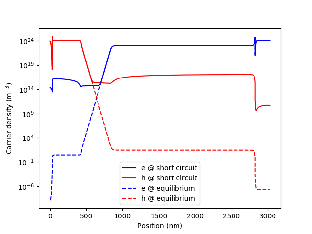
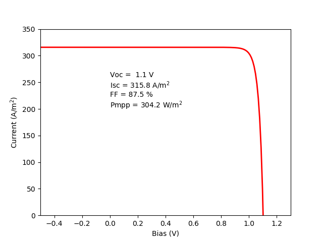
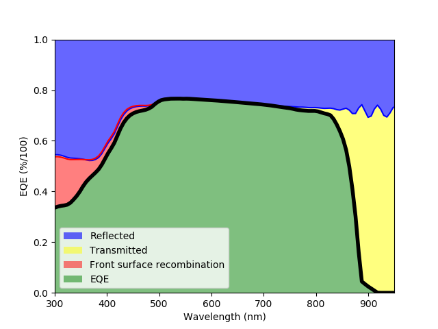

Drift Diffusion Utilities
=========================

This module is the interface between Python and Fortran. It takes a structure created with the tools in :doc:`Device Structure <DeviceStructure>` and dumps all that information into the Fortran variables. Then, it runs the selected calculation. This process is completely transparent for the user who only needs to use the higher level methods in the :doc:`solar cell solver <solving_solar_cells>`.

At the end of this page there is a detailed description of the format of all the functions within this module, but here we focus in the more practical aspect, including also examples of usage.

.. py:function:: ProcessStructure(device [, wavelengths=None] )

	This function reads a dictionary containing all the device structure, extract the electrical and optical properties of the materials, and loads all that information into the Fortran variables. Finally, it initialises the device (in Fortran) calculating an initial mesh and all the properties as a function of the position. An initial estimation of the quasi-Fermi energies, electrostatic potential and carrier concentration is also performed. This will be used as initial condition for the numerical solver.

	**Output** (see :ref:`output-dictionary`): **Properties**

.. py:function:: equilibrium_pdd(junction, options):

	Solves the PDD equations under equilibrium: in the dark with no external current and zero applied voltage. Internally, it calls *CreateDeviceStructure* to retrieve all the material parameters (as described in :doc:`DeviceStructure`) and *ProcessStructure* to dump all the data into the Fortran variables and perform the initialization of the structure.

	After finishing the calculation, the junction object will be updated with an attribute called "equilibrium_data" containing the dictionaries **Properties** and **Bandstructure** (see :ref:`output-dictionary`).

.. py:function:: short_circuit_pdd(junction, options):

	Solves the PDD equations under short circuit conditions: current flowing through the structure due to the light absorbed and zero applied voltage. It calls internally to *equilibrium_pdd* before solving the problem in short circuit.

	After finishing the calculation, the junction object will be updated with an attribute called "short_circuit_data" containing the dictionaries **Properties**, **Bandstructure** and **Optics** (see :ref:`output-dictionary`), in addition to the "equilibrium_data" attribute.

The following example shows the result of calculating a solar cell under short circuit conditions, comparing the resulting band structure. Note that neither equilibrium_pdd nor short_circuit_pdd are called directly, but they are accessed internally by *solar_cell_solver*.

.. code-block:: python

    import matplotlib.pyplot as plt

    from solcore import material
    from solcore.structure import Layer, Junction
    from solcore.solar_cell import SolarCell
    from solcore.solar_cell_solver import solar_cell_solver

    T = 298

    # First, we create the materials, overriding any default property we want, such as the doping or the absorption coefficient
    window = material('AlGaAs')(T=T, Na=1e24, Al=0.8)
    p_GaAs = material('GaAs')(T=T, Na=1e24)
    i_GaAs = material('GaAs')(T=T)
    n_GaAs = material('GaAs')(T=T, Nd=1e23)
    bsf = material('AlGaAs')(T=T, Nd=1e24, Al=0.4)

    # We put everything together in a Junction.
    MyJunction = Junction([ Layer(width=30e-9, material=window, role="Window"),
                            Layer(width=400e-9, material=p_GaAs, role="Emitter"),
                            Layer(width=400e-9, material=i_GaAs, role="Intrinsic"),
                            Layer(width=2000e-9, material=n_GaAs, role="Base"),
                            Layer(width=200e-9, material=bsf, role="BSF")],
                            sn=1e3, sp=1e3, T=T, kind='PDD')

    my_solar_cell = SolarCell([MyJunction], T=T, R_series=0, substrate=n_GaAs)

    # We solve the short circuit problem
    solar_cell_solver(my_solar_cell, 'short_circuit')

    # We can plot the electron and hole densities in short circuit...
    zz = my_solar_cell[0].short_circuit_data.Bandstructure['x'] * 1e9
    n = my_solar_cell[0].short_circuit_data.Bandstructure['n']
    p = my_solar_cell[0].short_circuit_data.Bandstructure['p']
    plt.semilogy(zz, n, 'b', label='e @ short circuit')
    plt.semilogy(zz, p, 'r', label='h @ short circuit')

    # ... and equilibrium
    zz = my_solar_cell[0].equilibrium_data.Bandstructure['x'] * 1e9
    n = my_solar_cell[0].equilibrium_data.Bandstructure['n']
    p = my_solar_cell[0].equilibrium_data.Bandstructure['p']
    plt.semilogy(zz, n, 'b--', label='e @ equilibrium')
    plt.semilogy(zz, p, 'r--', label='h @ equilibrium')

    plt.xlabel('Position (nm)')
    plt.ylabel('Carrier density (m$^{-3}$)')
    plt.legend()
    plt.show()

The result of the above calculation is this:
	

.. py:function:: iv_pdd(junction, options):

	Calculates the IV curve of the device at the **internal_voltages** indicated in the options. Depending on the options, also, the IV will be calculated in the dark (calling the equilibrium_pdd function) or under illumination (calling the short_circuit_pdd function). If the voltage range has positive and negative values, the problem is solved twice: from 0 V to the maximum positive and from 0 V to the maximum negative, concatenating the results afterwards.

    After finishing the calculation, the Junction object will have a few extra attributes, in addition to those resulting from equilibrium_pdd and short_circuit_pdd (yes, there is a lot of redundancy at the moment):

    - **pdd_data**: Contains all the data (**Properties**, **Bandstructure**, etc.) of the positive and negative voltage calculations.
    - **voltage**: An array with the internal_voltages
    - **current**: An array with the total current at the internal_voltages, including the effect of any shunt resistance, if present.
    - **recombination_currents**: A dictionary containing the different recombination currents at the internal voltages: radiative, SRH, Auger and surface recombination.
    - **iv**: A function that returns the current at the input voltage. Essentially, it interpolates the voltages and currents of the junction using the Scipy function interp1d.

In the following example, we use the same solar cell described above and calculate the dark IV curve, plotting the different contributions to the current.

.. code-block:: python

    import matplotlib.pyplot as plt

    from solcore import material
    from solcore.structure import Layer, Junction
    from solcore.solar_cell import SolarCell
    from solcore.solar_cell_solver import solar_cell_solver

    T = 298

    substrate = material('GaAs')(T=T)

    # First, we create the materials, overriding any default property we want, such as the doping or the absorption coefficient
    window = material('AlGaAs')(T=T, Na=1e24, Al=0.8)
    p_GaAs = material('GaAs')(T=T, Na=1e24)
    i_GaAs = material('GaAs')(T=T)
    n_GaAs = material('GaAs')(T=T, Nd=1e23)
    bsf = material('AlGaAs')(T=T, Nd=1e24, Al=0.4)

    # We put everything together in a Junction. We include the surface recombination velocities,
    # sn and sp, although they are not necessary in this case.
    MyJunction = Junction([Layer(width=30e-9, material=window, role="Window"),
                           Layer(width=400e-9, material=p_GaAs, role="Emitter"),
                           Layer(width=400e-9, material=i_GaAs, role="Intrinsic"),
                           Layer(width=2000e-9, material=n_GaAs, role="Base"),
                           Layer(width=200e-9, material=bsf, role="BSF")],
                          sn=1e3, sp=1e3, T=T, kind='PDD')

    my_solar_cell = SolarCell([MyJunction], T=T, R_series=0, substrate=substrate)

    # We calculate the IV curve under illumination, using all the default options
    solar_cell_solver(my_solar_cell, 'iv')

    plt.semilogy(my_solar_cell[0].voltage, abs(my_solar_cell[0].current), 'k', linewidth=4, label='Total')
    plt.semilogy(my_solar_cell[0].voltage, abs(my_solar_cell[0].recombination_currents['Jrad']), 'r', label='Jrad')
    plt.semilogy(my_solar_cell[0].voltage, abs(my_solar_cell[0].recombination_currents['Jsrh']), 'b', label='Jsrh')
    plt.semilogy(my_solar_cell[0].voltage, abs(my_solar_cell[0].recombination_currents['Jsur']), 'g', label='Jsur')

    plt.legend()
    plt.xlim(-0.5, 1.3)
    plt.ylim(1e-10, 1e5)
    plt.xlabel('Bias (V)')
    plt.ylabel('Current (A/m$^2}$)')

    plt.show()

The result of the above calculation is this:
	
.. image:: Figures/IV.png
    :align: center

In order to get the IV curve under illumination, we simply indicate it with the *user_options* keyword in the solar_solar_cell solver function, also asking for the parameters under illumination (Voc, Isc, etc.).

.. code-block:: python

    solar_cell_solver(my_solar_cell, 'iv', user_options={'light_iv' : True, 'mpp' : True})

    plt.plot(my_solar_cell[0].voltage, -my_solar_cell[0].current, 'r', linewidth=2, label='Total')

    plt.xlim(-0.5, 1.3)
    plt.ylim(0, 350)
    plt.xlabel('Bias (V)')
    plt.ylabel('Current (A/m$^2}$)')

    plt.text(0, 200, 'Voc = {:4.1f} V\n'
                     'Isc = {:4.1f} A/m${^2}$\n'
                     'FF = {:4.1f} %\n'
                     'Pmpp = {:4.1f} W/m${^2}$'.format(my_solar_cell.iv['Voc'], my_solar_cell.iv['Isc'],
                                               my_solar_cell.iv['FF'] * 100, my_solar_cell.iv['Pmpp']))

While the power at maximum power point seems very high (>300 W/m :sup:`2` ) let's keep in mind that the default modelling options use the Beer-Lambert law optics method which *does not take into account* front surface reflection. If that is included (for example using the TMM optics method) Isc will be much lower and so will the power.
	

.. py:function:: qe_pdd(junction, options):

	Calculates the quantum efficiency at short circuit with bias light, given in the options. Internally, it calls short_circuit_pdd, getting all the related output information (see above).

    After finishing the calculation, the junction object will have an attribute called **qe_data** with the EQE and all the associated losses due to radiative recombination, SRH recombination, Auger recombination or front/back surface recombination. It will also have a method **eqe** that accepts an array of wavelengths and returns the EQE.

.. code-block:: Python

    import matplotlib.pyplot as plt

    from solcore import material
    from solcore.structure import Layer, Junction
    from solcore.solar_cell import SolarCell
    from solcore.solar_cell_solver import solar_cell_solver

    T = 298

    substrate = material('GaAs')(T=T)

    # First, we create the materials, overriding any default property we want, such as the doping or the absorption coefficient
    window = material('AlGaAs')(T=T, Na=1e24, Al=0.8)
    p_GaAs = material('GaAs')(T=T, Na=1e24)
    i_GaAs = material('GaAs')(T=T)
    n_GaAs = material('GaAs')(T=T, Nd=1e23)
    bsf = material('AlGaAs')(T=T, Nd=1e24, Al=0.4)

    # We put everything together in a Junction. We include the surface recombination velocities,
    # sn and sp, although they are not necessary in this case.
    MyJunction = Junction([Layer(width=30e-9, material=window, role="Window"),
                           Layer(width=400e-9, material=p_GaAs, role="Emitter"),
                           Layer(width=400e-9, material=i_GaAs, role="Intrinsic"),
                           Layer(width=2000e-9, material=n_GaAs, role="Base"),
                           Layer(width=200e-9, material=bsf, role="BSF")],
                          sn=1e6, sp=1e6, T=T, kind='PDD')

    my_solar_cell = SolarCell([MyJunction], T=T, R_series=0, substrate=substrate)

    # We calculate the EQE of the cell, using the TMM optics method.
    solar_cell_solver(my_solar_cell, 'qe', user_options={'optics_method': 'TMM'})

    wl = my_solar_cell[0].qe_data.wavelengths * 1e9

    plt.plot(wl, 1 - my_solar_cell.reflected, 'b')
    plt.fill_between(wl, 1 - my_solar_cell.reflected, 1, facecolor='blue', alpha=0.6, label='Reflected')
    plt.fill_between(wl, 1 - my_solar_cell.reflected, my_solar_cell.absorbed, facecolor='yellow', alpha=0.5,
                     label='Transmitted')

    # EQE + fraction lost due to recombination in the front surface
    plt.plot(wl, my_solar_cell[0].qe_data.EQE + my_solar_cell[0].qe_data.EQEsurf, 'r')
    plt.fill_between(wl, my_solar_cell[0].qe_data.EQE + my_solar_cell[0].qe_data.EQEsurf, my_solar_cell[0].qe_data.EQE,
                     facecolor='red', alpha=0.5, label='Front surface recombination')

    plt.plot(wl, my_solar_cell[0].qe_data.EQE, 'k', linewidth=4)
    plt.fill_between(wl, my_solar_cell[0].qe_data.EQE, 0, facecolor='green', alpha=0.5, label='EQE')

    plt.legend()
    plt.xlim(300, 950)
    plt.ylim(0, 1)
    plt.xlabel('Wavelength (nm)')
    plt.ylabel('EQE (%/100)')

    plt.show()

The result of running the code above is the next figure, where the EQE of the cell is plotted together with the main sources of losses in this particular case: reflection, recombination in the front surface and sub-bandgap light transmission.

In principle, EQE + all the internal sources of losses (SRH, surface recombination, etc.) should be equal to the total absorbed light and, in any case, smaller than 1. **Sometimes this does not happen and the result is > 1**. The reason is the vertical discretization process of the solar cell which is not accurate in situations where there is a fast variation of the absorption and/or the electron generation. This happens at short wavelengths, when absorption is very fast in the first few nanometers, and at longer wavelengths in the presence of oscillations due to interference. There are three tricks to tackle this issue:

- Increase the number of mesh points in the PDD solver by adjusting the options dealing with the mesh creation (see below and :ref:`solver-options`). This will result in a global increase in mesh points and therefore will make the PDD solver slower.
- Divide thick layers into thinner ones. This will increase the number of mesh points locally in that region, and therefore good if the one causing problems is identified. This solution is helpful for the case of fast oscillations.
- Increase the number of points used by the optical solver. By default, this is one point per angstrom, and therefore very dense already, but might help, specially at short wavelengths. This is controlled by the 'position' option (see :ref:`solver-options`).

Setting different aspects of the solver
---------------------------------------

.. py:function:: SetMeshParameters(**kwargs)

Set the parameters that control the meshing of the structure. Changing this values might improve convergence in some difficult cases. The absolute maximum number of meshpoints at any time is 6000. The keywords and default values are:
	
	- **meshpoints = -400** : Defines the type of meshing that must be done. 
		- *meshpoints* > 0: The mesh is homogeneous with that many mesh points. 
		- *meshpoints* = 0: The mesh is inhomogeneous with master nodes at the interfaces between layers and denser mesh around them. This density and distribution of the points are controlled by the variables *coarse*, *fine* and *ultrafine*. 
		- *meshpoints* < 0: The exact value does not matter. The mesh is inhomogeneous with master nodes at the interfaces between layers and denser mesh around them. Initially, their density and distribution is controlled by the variables *coarse*, *fine* and *ultrafine* but then this is dynamically modified to increase or reduce their density in a 'smooth' way, wherever the mesh points are needed more. This dynamic remeshing is performed at different stages of the above solvers. Master nodes are not modified.		
		
	- **growth_rate = 0.7** : Defines how 'fast' mesh points are increased by the dynamic meshing routine. It should between 0 and 1. Small values produce denser meshes and larger values produce coarser ones.
	
	- **coarse = 20e-9**
	- **fine = 1e-9**
	- **ultrafine = 0.2e-9**
		Values are in nanometers. Define the structure of the inhomogeneous mesh and the initial dynamic mesh. After defining the master nodes (two nodes separated 0.1 nm per interface), the space between them is divided in equal size elemens smaller or equal than *coarse*. Then, the coarse elements adjacent to the master nodes are divided in equal size elemens smaller or equal than *fine*. Finally, the fine elements adjacent to the master nodes are divided in equal size elemens smaller or equal than *ultrafine*. This structure is static if *meshpoints* = 0 and evolves if *meshpoints* < 0 to a smoother configuration. 

.. image:: Figures/mesh.png
	:align: center
	
	
.. py:function:: SetRecombinationParameters(**kwargs)

	Activate (1) and deactivate (0) a given recombination mechanism. The 'virtual experiment' functions above use this function to activate/deactive the generation, depending of whether there is ligth or not. The keywords and default values are:

	- **srh = 1** : Schockley-Read-Hall recombination
	- **rad = 1** : Radiative recombination
	- **aug = 0** : Auger recombination
	- **sur = 1**	: Surface recombination (at the front and back contacts)
	- **gen = 0**	: Generation
	
	
.. py:function:: SetConvergenceParameters(**kwargs)

	Control the convergence of the solver by changing the maximum number of iterations and the tolerances. The keywords and default values are:
	
	- **clamp = 20** : In *kT* units. Limits the maximum change in the electrostatic potential and quasi-Fermi energies at each iteration of the solver. Smaller values migth improve convergence in detriment of the speed. 
	- **nitermax = 100** : Maximum number of iterations of the solver. 
	- **ATol = 1.5e-08** : Absolute tolerance of the solver. If the residual is smaller than this, the solver will finish. This is the square root of the machine epsilon of *numpy.float64*. Lower values than this often lead to numerical errors and lack of convergence, in adition to much lower speed.
	- **RTol = 1e-4** : Relative tolerance of the solver. If the difference of the residual between sucessive calculations is smaller than this value, the solver will finish.
	

.. _output-dictionary:

Output dictionary
-----------------

All virtual experiments described above produce a dictionary as output. A variable can be accessed as:
::

	output[<primary_key>][<secondary_key]

The total list of primary (columns) and secondary (rows) keys are:

============== ============== ============== ============== ==============
Properties     Bandstructure  IV             QE             Optics
============== ============== ============== ============== ==============
x              x              V              wavelengths    wavelengths
Xi             n              J              EQE            R
Eg	           p              Jrad           EQEsrh         T
Nd             ni             Jsrh           EQErad         \-
Na             Rho            Jaug           EQEaug         \-
Nc             Efe            Jsur           EQEsurf        \-
Nv             Efh            Jsc [a]_       EQEsurb        \-
\-             potential      Voc [a]_       \-             \-
\-             Ec             Jmpp [a]_      \-             \-
\-             Ev             Vmpp [a]_      \-             \-
\-             GR             FF [a]_        \-             \-
\-             G              \-             \-             \-
\-             Rrad           \-             \-             \-
\-             Rsrh           \-             \-             \-
\-             Raug           \-             \-             \-
============== ============== ============== ============== ==============

.. [a] Only available in light IV if *IV_info=True*

All functions description
-------------------------

.. automodule:: solcore.poisson_drift_diffusion.DriftDiffusionUtilities
    :members:
    :undoc-members:

References
----------

.. [#Ref1] S. Adachi “Optical dispersion relations for GaP, GaAs, GaSb, InP, InAs, InSb, AlxGa1−xAs, and In1−xGaxAsyP1−y,” J. Appl. Phys.,66, 6030 (1989).

.. [#Ref4] Reference AM1.5 Spectra. NREL. http://rredc.nrel.gov/solar/spectra/am1.5/
	