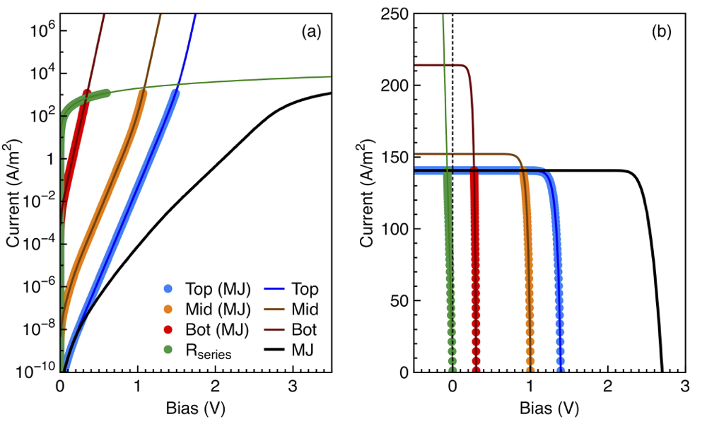
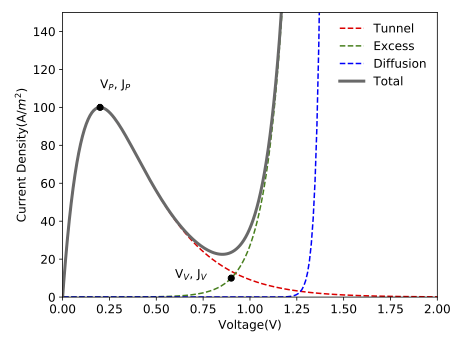

Multi-junction electrical solver
================================

- Example 1: :doc:`Tutorial: 2J solar cell with QWs in the bottom cell <../Examples/tutorial>`
- Example 2: :doc:`Example of a 2J solar cell calculated with the PDD solver <../Examples/example_PDD_solver>`
- Example 3: :doc:`Radiative coupling in a 3J solar cell <../Examples/example_radiative_coupling>`
- Example 4: :doc:`MJ solar cell efficiency map <../Examples/example_MJ_efficiency_map>`
- Example 5: :doc:`Traditional GaInP/InGaAs/Ge solar cell <../Examples/example_3J_with_DA_solver>`
- Example 6: :doc:`Example of a tunnel junction <../Examples/example_tunnel_junction>`

A complete photovoltaic solar cell can include one or more junctions, metal contacts, optical layers (including anti-reflective coatings and nano-photonic structures) and tunnel junctions. The junctions, in turn, might range from simple PN homojunctions to complex heterojunctions, including multi-quantum well structures. The solvers described so far only calculate the properties of single junction devices. To combine them into a multi-junction device, it is necessary to consider that the individual junctions are electrically connected in series and the potential coupling of light emitted by the wider bandgap junctions into those with smaller bandgap.

No radiative coupling
---------------------

We first consider the case of no radiative coupling between junctions.
This is a good approximation for materials which do not radiate
efficiently or radiative materials working at low concentration, when
the fraction of radiative recombination compared to non-radiative
recombination is low. In this case, the IV curve of each junction can be
calculated independently of each other and the current flowing through
the MJ structure is limited by the junction with the lowest current at
any given voltage. Series resistances defined for each junction are now
added together and included as a single term. The operating voltage of
each of the junctions is finally back-calculated and added together to
get the voltage of the MJ device.

The pseudocode for this solver is:

#. Calculate the :math:`I_j(V)` of each junction :math:`j` in the
   structure.

#. Find the current flowing through the MJ device as
   :math:`I_{MJ}(V) = I_j(V)`, if
   :math:`|I_j(V)| = \min ([|I_1(V)|...|I_N(V)|])`.

#. Calculate the voltage of each junction by interpolating its IV curve
   at the new current values, :math:`V_j(I_{MJ})`, and the voltage
   dropped due to the series resistances, :math:`V_{Rs} = R_s I_{MJ}`.

#. Calculate the total voltage at a given current as
   :math:`V_{MJ} = V_{Rs} + \sum_j V_j`.

#. Interpolate the :math:`I_{MJ}(V_{MJ})` and the :math:`I_{MJ}(V_j)` to
   the desired output voltage values.

The figure shows the simulated IV curve of a 3J solar cell made
of Ge/InGaAs/GaAsP. The electrical properties of the three junctions
were calculated using the depletion approximation solver. In the dark
the voltages of each of the junctions at a given
current add together, resulting in the total voltage of the MJ
structure. The :math:`R_s` contribution to the voltage goes in the same
direction as those of the junctions. Under illumination the junction producing the lower current (the top
junction in this case) limits the overall current of the MJ device. At
zero bias, or even at some negative bias, the non-limiting junctions are
positively biased, recombining all the photocurrent that cannot be
extracted because of the limiting top cell. The contribution of the
:math:`R_s` to the voltage of the MJ device is negative, resulting in a
reduction of the fill factor and the overall efficiency of the solar
cell.

With radiative coupling
-----------------------

Radiative coupling takes place when the light produced by a high bandgap
junction due to radiative recombination is absorbed by a lower bandgap
junction, contributing to its photocurrent and changing the operating
point. It has been identified in numerous highly radiative materials
such as quantum well solar cells and III-V MJ solar
cells . It appears as an artefact during the QE measurements of MJ solar cells
but it is also an effect that can be exploited to increase the performance of MJ devices
and their tolerance to spectral changes, resulting in superior annual energy yield.

The radiative coupling formalism included in Solcore is based on the
works by Chan et al. (2014) and Nelson et al. (1997).

For a more detailed description of the radiative coupling calculator `refer to the main Solcore paper (open access) <https://doi.org/10.1007/s10825-018-1171-3>`_ and references therein.

An example of the radiative coupling in action can be found :doc:`here <../Examples/example_radiative_coupling>`.

Tunnel junctions
----------------

Solcore includes partial support for tunnel junctions. They represent an
optical loss due to parasitic absorption in the layers, but also an
electrical loss. At the moment, there are two models for tunnel
junctions. The first one is a simple resistive model, where the tunnel
junction is simply modelled as a series resistance. This approximation
should be valid in most cases, but will break down if the current is
close to or higher than the peak current density of the junction.

The second model is a parametric model, based on the simple formalism
described by Sze. In this model, the
total current of the tunnel junction will have three components: the
tunnel current :math:`J_T` accounting for band-to-band transport, the
excess current :math:`J_{ex}` related to transport across states inside
the forbidden gap, and the diffusion current :math:`J_D`, which is the
usual minority-carrier injection current in PN junctions. The following
equations summarise all these components.

.. math:: J_{TJ} = J_{T} + J_{ex} + J_D

.. math:: J_{T} = \frac{J_P V}{V_P} \exp{\left( 1 - \frac{V}{V_P} \right) }

.. math:: J_{ex} =J_V \exp{\left[ C \left( V - V_V \right) \right] }

.. math:: J_{D} =J_0 \left[  \exp{ \left( \frac{qV}{k_b T}  \right) } - 1  \right]

As illustrated in the next figure, :math:`J_P` and :math:`V_P` are the
peak current and voltage, :math:`J_V` and :math:`V_V` are the valley
current and voltages, :math:`C` is a prefactor of the exponent and
:math:`J_0` the reverse saturation current. In this simple
implementation, these 6 parameters need to be provided as inputs, and
can be used as fitting parameters to reproduce experimental data. This
allows to correctly account for the break down of the tunnel junction in
situations when the current is above the peak current.
The code for this example can be found :doc:`here <../Examples/example_tunnel_junction>`.

Solcore can also accept external IV data for the tunnel junctions and
the implementation of the more rigorous, but still analytic model,
described by Louarn *et al.* (2016) is currently under way in order to relate
the tunnel currents with the actual materials and layer structure used
in the tunnel junction definition.

Multi-junction IV functions
--------------------------

.. automodule:: solcore.analytic_solar_cells.IV
    :members:
    :undoc-members:

.. automodule:: solcore.analytic_solar_cells.tunnel_junctions
    :members:
    :undoc-members:
