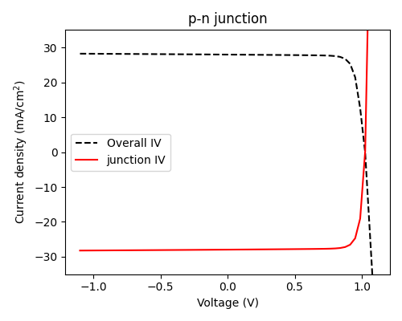
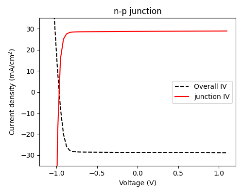

.. _sign-conventions:

Current-voltage sign conventions
================================

In order to maintain internal consistency, the following sign conventions are used for current and voltage:

- A positive voltage means that a higher potential is applied to the front contact of the cell.

  - For a **p-n junction** (i.e. p-type material is on top of n-type material), this means that a **positive
    voltage** results in 'solar cell operation' under illumination, with a positive open-circuit voltage (V\ :sub:`OC`).
  - For an **n-p junction**, a **negative voltage** must be applied for PV operation and V\ :sub:`OC` will be negative.

- For the junction object itself, the short-circuit current (J\ :sub:`SC`) is negative if the cell operates at positive voltage, and positive
  if the cell operates at negative voltage (the product of current and voltage is negative, i.e. work is being done
  *by* the cell). This relates to the data which is stored in ``junction.iv``.

- For the cell as a whole (i.e. the multi-junction IV for a multi-junction cell, or the IV with shunt resistance for
  a single-junction cell), the short-circuit current was taken to be positive for positive voltages. This means that
  it will be negative for negative voltages.

- The two-diode (2D) and detailed-balance (DB) models always assume that, in this sign convention, the cell has the polarity of
  a p-n junction (positive voltage should be applied)

Note that the sign conventions here were always the case for the (Fortran) PDD solver, but were not used consistently
by the depletion approximation solver before version 5.10, which always assumed that V\ :sub:`OC` and J\ :sub:`SC` were positive. This
does not matter for single-junction cells, since the choice is arbitrary, but caused inconsistencies when defining
n-p cells which mix different types of junction.
