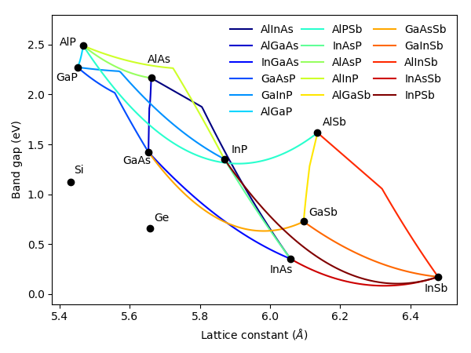

The Material System
===================

.. toctree::
    :maxdepth: 1

    Materials

The parameters database contains the basic properties of many
semiconductor materials, including silicon, germanium and many III-V
semiconductor binary and ternary alloys. Among other parameters, it
includes the energy bandgap, the electron and hole effective masses, the
lattice constants and the elastic constants.

The main sources of data are the article by I. Vurgaftman on *Band
parameters for III-V semiconductors* ([#Ref10]_) and the *Handbook Series on
Semiconductor Parameters* by Levinshtein et al.([#Ref9]_). The carrier mobility calculator
is based on the empirical low-field mobility model by Sotoodeh et
al. ([#Ref6]_) and it is available only for
some materials where the inputs for the model are available.

There are two methods for retrieving parameters from the database. The
first one consists simply of getting the data using the
``get_parameter`` function with the required inputs. For example:

.. code-block:: Python

    get_parameter("GaAsP", "band_gap", P=0.45, T=300)

will return the bandgap of GaAsP for a phosphorus concentration of 45%
at a temperature of 300 K, equal to 1.988 eV. This method only uses the
existing data. Another method is to create a material object which will
contain all the properties existing in the database for that material,
as well as those included as input, which will override the value of the
database parameter, if it exists. The following example creates a GaAs
object and an AlGaAs object, using a custom electron effective mass in
the latter:

.. code-block:: Python

    GaAs = material("GaAs")(T=300, Na=1e24)
    AlGaAs = material("AlGaAs")(T=300, Al=0.3, Nd=1e23, eff_mass_electron=0.1)

Now, any parameter - including the custom ones - are attributes that can
be easily accessed and used anywhere in the program. For example
``GaAs.band_gap`` is the GaAs bandgap and ``AlGaAs.lattice_constant`` is
the AlGaAs lattice constant, both at the composition and temperature
chosen when creating the objects.

The image below shows the well-known bandgap vs. lattice constant
map of all semiconductor materials and alloys (only ternary compounds)
currently implemented into Solcore. However, any other material can be
used in all of the Solcore functions, as long as the necessary input
parameters are provided. This can be done by overriding all the
properties of an existing material during the creation as above, or
adding it as an external material in the configuration files.

The material class
------------------

.. automodule:: solcore.material_system.material_system
    :members:
    :undoc-members:

Accessing parameters
---------------------

.. automodule:: solcore.parameter_system.parameter_system
    :members:
    :undoc-members:

The mobility module
-------------------

This module allows to calculate the carrier mobilities based on the material composition, temperature (T>100K) and impurity concentration. It is an implementation of the mobility model by Sotoodeh *et al.* ([#Ref6]_). The material class described above uses this module internally to get the mobililty of the materials it is implemented for.

The material parameters used in the model are included in the file *mobility_parameters.json*. At the moment, the supported materials are:

	  - **Binaries**: AlAs, GaAs, InAs, InP, GaP
	  - **Ternaries**: InAlAs, AlGaAs, InGaAs, GaInP, (GaAsP), (InAsP)
	  - **Quaternaries**: InGaAsP

The last two ternaries are simply calculated as a linear interpolation of the parameters of the corresponding binaries, so the transition from direct to indirect bandgap and other dependencies might not be very accurate. *InGaAsP*, in turn, is calculated only based on the *InGaAs* and *GaInP* data and it is mostly valid for compositions lattice matched to *InP*.

.. automodule:: solcore.material_data.mobility
    :members:
    :undoc-members:

The critical point picker
-------------------------

.. automodule:: solcore.material_system.critical_point_picker
    :members:
    :undoc-members:

References
----------

.. [#Ref10] Vurgaftman, I., Meyer, J.R., Ram-Mohan, L.R.: Band parameters for III–V compound semiconductors and their alloys. J. Appl. Phys. 89(11), 5815–5875 (2001)
.. [#Ref9] Levinshtein, M., Rumyantsev, S., Shur, M., Levinshtein, M., Rumyantsev, S., Shur, M.: Handbook Series on Semiconductor Parameters, ser. Volume 2: Ternary and Quaternary III-V Com- pounds, vol. 2. World Scientific, Singapore (2012)
.. [#Ref6] M. Sotoodeh, A. H. Khalid, and A. A. Rezazadeh, “Empirical low-field mobility model for III–V compounds applicable in device simulation codes,” *J. Appl. Phys.*, **87**, 2890, (2000).