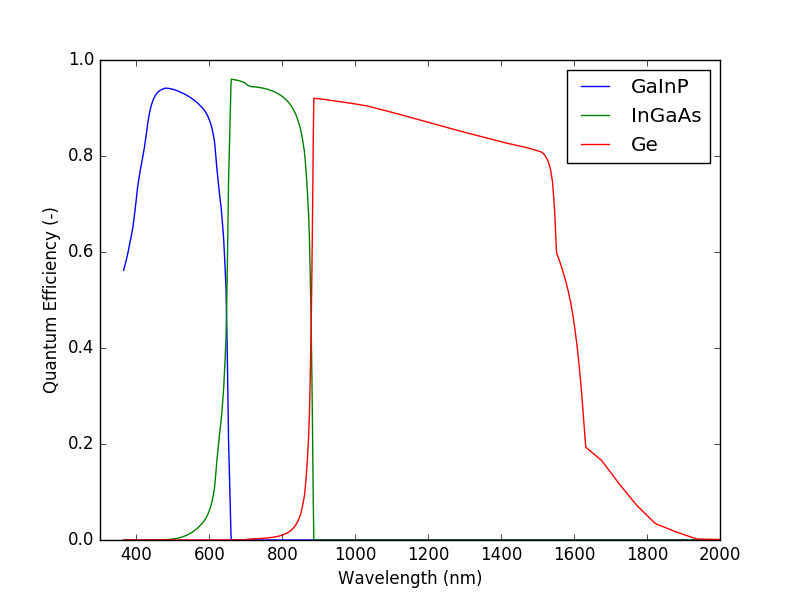

Analytic solar cells calculator
===============================

**WARNING: Documentation not updated for Solcore 5**

This package include the tools to calculate, using an analytical approach, the quantum efficiency or the IV characteristics of a solar cell (single junction or multi-junction). The tools that can be accessed directly when importing this package are:

- multijunctionIV
- spectral_response_all_junctions

Check below for other tools that might be available when importing the modules within this package.

.. _quantum_efficiency_calculator:

Quantum efficiency calculator
-----------------------------
This module calculates the quantum efficiency of any number of junctions. It uses the diffusion coefficients, diffusion lengths and the depletion aproximation to find out the fraction of photon that can be collected as a function or energy.

Contrary to the :ref:`iv_calculator`, calculating the QE requires a substantial amount of information related to the material properties for each of the junctions and each of the layers that form each junction. In the next example we show the structure definition for calculating the QE of a GaInP/InGaAs/Ge tripple junction solar cell. Each subcell is a PN junction - requiring therefore two materials, one for the P and the other for the N side - and also includes a window layer and an AR coating.
::

    import numpy as np
    import os
    from solcore import siUnits, material, si, asUnit
    from solcore.constants import h, c, vacuum_permittivity
    from solcore.structure import Structure, Junction, Layer
    from solcore.state import State
    from solcore.interpolate import interp1d

    # We need to build the solar cell layer by layer.
    # All the materials will be stored in this list, from top to bottom.
    all_materials = []

    # We start from the AR coating. We only need this to define the reflexion of the cell.
    # In this case, we load it from an an external file
    def this_dir_file(f):
        return os.path.join(os.path.split(__file__)[0], f)

    refl_nm = np.loadtxt(this_dir_file("MgF-ZnS_AR.csv"), unpack=True, delimiter=",")
    refl_J = np.array((h * c / siUnits(refl_nm[0], "nm")[::-1], refl_nm[1][::-1]))

    # Next is the window layer, made of AlInP. We load the absorption coefficent of AlInP from an external file, too
    AlInP = material("AlInP")
    window_material = AlInP(Al=0.52)
    window_alpha = np.loadtxt(this_dir_file("alinp.csv"), unpack=True, delimiter=",")
    window_material.alphaE = interp1d(x=siUnits(window_alpha[0], "eV"), y=window_alpha[1], bounds_error=False, fill_value=0)

    all_materials.append(window_material)

    # TOP CELL - GaInP
    # Now we build the top cell, which requires the n and p sides of GaInP.
    # We also load the absorption coefficient from an external file. We also add some extra parameters needed for the
    # calculation such as the minority carriers diffusion lengths
    InGaP = material("GaInP")
    top_cell_n_material = InGaP(In=0.49, Nd=siUnits(2e18, "cm-3"), role="n")
    top_cell_p_material = InGaP(In=0.49, Na=siUnits(1e17, "cm-3"), role="p")
    top_cell_alpha = np.loadtxt(this_dir_file("in048ga052p.csv"), unpack=True, delimiter=",")
    top_cell_n_material.alphaE = interp1d(x=siUnits(top_cell_alpha[0], "eV"), y=top_cell_alpha[1], bounds_error=False,
                                          fill_value=0)
    top_cell_p_material.alphaE = top_cell_n_material.alphaE
    top_cell_n_material.hole_minority_carrier_diffusion_length = si("200nm")
    top_cell_p_material.electron_minority_carrier_diffusion_length = si("1um")

    all_materials.append(top_cell_n_material)
    all_materials.append(top_cell_p_material)

    # MID CELL  - InGaAs
    # The same thing.
    InGaAs = material("InGaAs")
    mid_cell_n_material = InGaAs(In=0.01, Nd=siUnits(3e18, "cm-3"), role="n")
    mid_cell_p_material = InGaAs(In=0.01, Na=siUnits(1e17, "cm-3"), role="p")
    mid_cell_alpha = np.loadtxt(this_dir_file("in01gaas.csv"), unpack=True, delimiter=",")
    mid_cell_n_material.alphaE = interp1d(x=siUnits(mid_cell_alpha[0], "eV"), y=mid_cell_alpha[1], bounds_error=False,
                                          fill_value=0)
    mid_cell_p_material.alphaE = mid_cell_n_material.alphaE
    mid_cell_n_material.hole_minority_carrier_diffusion_length = si("500nm")
    mid_cell_p_material.electron_minority_carrier_diffusion_length = si("5um")

    all_materials.append(mid_cell_n_material)
    all_materials.append(mid_cell_p_material)

    # BOTTOM CELL - Ge
    # Idem
    Ge = material("Ge")
    bot_cell_n_material = Ge(Nd=siUnits(2e18, "cm-3"), role="n")
    bot_cell_p_material = Ge(Na=siUnits(1e17, "cm-3"), role="p")
    Ge_alpha = np.loadtxt(this_dir_file("Ge-Palik.csv"), unpack=True, delimiter=",")
    Ge.alphaE = interp1d(x=siUnits(Ge_alpha[0], 'eV'), y=Ge_alpha[1])
    bot_cell_n_material.hole_minority_carrier_diffusion_length = si("800nm")
    bot_cell_p_material.electron_minority_carrier_diffusion_length = si("50um")

    all_materials.append(bot_cell_n_material)
    all_materials.append(bot_cell_p_material)

    # We add some other properties to the materials, assumed the same in all cases.
    # If different, we should have added them above.
    for mat in all_materials:
        mat.hole_mobility = 3.4e-3
        mat.electron_mobility = 5e-2
        mat.dielectric_constant = 9 * vacuum_permittivity

    # And, finally, we put everything together, adding also the surface recombination velocities.
    triplejunction = Structure(
        [
            Layer(material=window_material, width=si("25nm")),
            Junction(
                (
                    Layer(si("100nm"), material=top_cell_n_material),
                    Layer(si("600nm"), material=top_cell_p_material),
                ),
                sn=1,
                sp=1,
            ),
            Junction(
                (
                    Layer(si("100nm"), material=mid_cell_n_material),
                    Layer(si("3.5um"), material=mid_cell_p_material),
                ),
                sn=1,
                sp=1,
            ),
            Junction(
                (
                    Layer(si("400nm"), material=bot_cell_n_material),
                    Layer(si("100um"), material=bot_cell_p_material),
                ),
                sn=1,
                sp=1,
            ),
        ]
    )

    # Now the 'solar_cell' object below contains all the information regarding the solar cell. So, we use it
    solar_cell = State()
    solar_cell.structure = triplejunction
    solar_cell.reflectivity = refl_J

So far, it has been only the definition of the structure. To actually calculate the quantum efficiency we need to add the energy range in which we want to calculate the results and call the *spectral_response_all_junctions* function:
::

    import solcore.analytic_solar_cells as ASC

    # The energy in SI units
    E = si(np.linspace(0.6, 3.4, 1000), "eV")

    # We add this energy to the solar cell structure.
    solar_cell.energies = E

    # We run the simulation. Verbose=True ensures that we have a full report of the parameters printed on the screen
    qe_result = ASC.spectral_response_all_junctions(solar_cell, verbose=True)

Below there is an image of the QE corresponding to the three junctions as a function of wavelength, which is a more common representation.

Since we didn't define any solar spectrum or solar cell geometry, we can not have the short circuit current for each of the junctions. We add that information to the solar_cell object above and sun again the solver. We are assuming we have some concentration optics and metallisation on top of the solar cell:
::

    from solcore.solar_spectrum import calculate_spectrum_spectral2

    # Configure cell geometry and concentration
    # Cell area is stated to be 7mm x 7mm
    cell_area = 0.7 * 0.7 / 1e4  # expressed in m-2
    # Geometrical concentration is 1000, but the optical efficiency is approximately 0.85 and cell metalisation shading 8%
    concentration_factor = 1000 * 0.85 * (1 - 0.08)

    # We create a solar spectrum using SPECTRAL2 and the default configuration
    # - See documentation and example of that package for more info
    spectrum = calculate_spectrum_spectral2()

    # We use the spectrum is in SI units: Watts m-2 joule-1.
    incident_x_J_y_per_J = spectrum["incident spectrum energy si"]
    incident_function = interp1d(y=incident_x_J_y_per_J[1] * concentration_factor * cell_area, x=incident_x_J_y_per_J[0])
    power_density = spectrum["incident power density"]
    print('Power density = {:.2f} W m-2\n'.format(power_density))

    # We already have the energies, as defined above
    solar_cell.incident_light = (E, incident_function(E) / E )
    qe_result = ASC.spectral_response_all_junctions(solar_cell, verbose=False)

    print("Subcell photocurrent density [mA cm-2]:")
    print('\tJsc(Top) = {:.2f}'.format(1e3 * qe_result["junctions"][0]["J"] / (cell_area * 1e4 * concentration_factor)))
    print('\tJsc(Mid) = {:.2f}'.format(1e3 * qe_result["junctions"][1]["J"] / (cell_area * 1e4 * concentration_factor)))
    print('\tJsc(Bot) = {:.2f}'.format(1e3 * qe_result["junctions"][2]["J"] / (cell_area * 1e4 * concentration_factor)))

After these modifications, the quantum efficiency has not changed, but we can have the short circuit current density of each of the subcells:
::

    Power density = 891.90 W m-2

    Subcell photocurrent density [mA cm-2]:
        Jsc(Top) = 9.73
        Jsc(Mid) = 12.02
        Jsc(Bot) = 25.18

.. automodule:: solcore.analytic_solar_cells.QE
    :members:
    :undoc-members:

.. _iv_calculator:

Multi-junction current voltage calculator
-----------------------------------------
This module contanes all the functions necessary to calculate the IV curve of single and multi-junction solar cells using the2-diode equation as the starting point. In addition to the *multijunctionIV* function that can invoked directly when importing the solcore.analytic_solar_cells package, this module containes several tools to calculate the reverse saturation currents under the radiative aproximation, using a radiative efficiency or based on the knowledge of Voc and Jsc.

Here is an example on how to use this module to calculate the IV curve of a triple junction solar cell, using the results of the Example 3 above (see :ref:`quantum_efficiency_calculator`) and ploting them with the *solcore.graphing* package:
::

    import numpy as np
    from solcore.structure import Structure, Junction
    import solcore.analytic_solar_cells as ASC
    from solcore.state import State
    from solcore.graphing import *

    # We import the QE results obtained in ASC_example_3 which contain the short circuit currents of each junction
    # when the solar cell is illuminated with the default SPECTAL2 spectrum
    from ASC_example_3 import qe_result, power_density, cell_area, concentration_factor

    # Ref temperature ºC. Let's say we have the reverse saturation currents J01 and J02 of each junction at a
    # reference temperature and we want the IV curve at a different one. We have to make a correction to the J01 and J02
    cell_temp = 60
    ref_temp = 25

    Tcell = 273 + cell_temp
    Tref = 273 + ref_temp

    # The IV data will be stored in a State object. We create it, including the cell and reference temperatures.
    IV_calculation_state = State(T=Tcell, Tref=Tref)

    # From the QE object we get the short circuit currents
    Isc_array = [qe_result["junctions"][0]["J"], qe_result["junctions"][1]["J"], qe_result["junctions"][2]["J"]]

    # And we create a list with the reverse saturation currents. In this case, we don't calculate them but just assume we
    # have them from somewhere.
    I01_array = [4.93e-24, 1.0e-21, 4.93e-6]
    I02_array = [3.28e-15, 2.7e-10, 1.0e-5]

    # This is the structure to calculate.
    IV_calculation_state.structure = Structure(
        [
            Junction(Eg=1.9, j01=I01_array[0], j02=I02_array[0], R_shunt=3e6,
                     R_series=0.0236, n1=1.00, n2=2.0, photocurrent=Isc_array[0]),
            Junction(Eg=1.4, j01=I01_array[1], j02=I02_array[1], R_shunt=1.5e6,
                     R_series=0.0012, n1=1.00, n2=2.0, photocurrent=Isc_array[1]),
            Junction(Eg=0.66, j01=I01_array[2], j02=I02_array[2], R_shunt=115,
                     R_series=8e-4, n1=1.00, n2=2.0, photocurrent=Isc_array[2]),
        ]
    )

    # We solve it, including explicitely the range of voltages we are interested
    IV_result = ASC.multijunctionIV(IV_calculation_state, V=np.linspace(0, 4, 1000))

    # We use the tools of the graphing package to get a nice plot of the IV curves.
    junction_colors = ["blue", "green", "red"]
    graph_lines = [GraphData(iv, label="Junction {}".format(i + 1), color=junction_colors[i])
                   for i, iv in enumerate(IV_result["junction IV"])]
    graph_lines.append(GraphData(IV_result["IV"], linewidth=2, color="black", label="Multijunction"))
    g = Graph(graph_lines, ylim=(0, 7), xlabel="Bias (V)", ylabel="Current (A)", legend="best").draw()

    eta = IV_result["Pmpp"] / (power_density * cell_area * concentration_factor)

    print('\nThe solar cell properties are: ')
    print('\tIsc = {:.2f} mA cm-2'.format(1e3 * IV_result["Isc"] / (cell_area * 1e4 * concentration_factor) ))
    print('\tVoc = {:.2f} V'.format(IV_result["Voc"]))
    print('\tFF = {:.2f} % '.format(IV_result["FF"] * 100))
    print('\tEta = {:.2f} %'.format(eta * 100))

The result of the above coe will be the figure below and the following output:
::

    Power density = 891.90 W m-2

    Subcell photocurrent density [mA cm-2]:
        Jsc(Top) = 9.73
        Jsc(Mid) = 12.02
        Jsc(Bot) = 25.18

    The solar cell properties are:
        Isc = 9.73 mA cm-2
        Voc = 3.34 V
        FF = 89.20 %
        Eta = 32.51 %

.. image:: Figures/iv_mj.png
	:align: center

.. automodule:: solcore.analytic_solar_cells.IV
    :members:
    :undoc-members:
